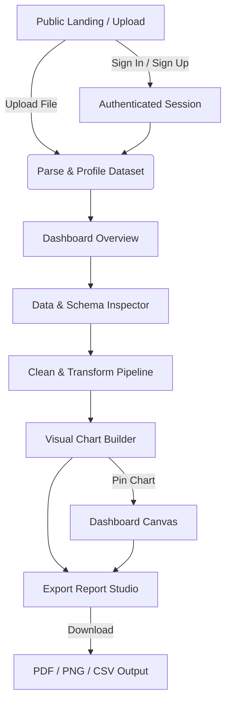
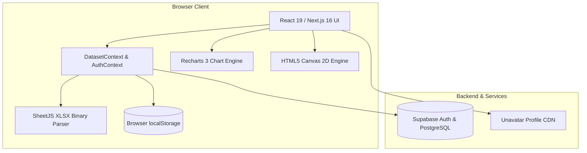

# Product Requirements Document (PRD) — DataVista

**Document Status**: Implementation-Grounded Reverse-Engineered Specification  
**System Name**: DataVista  
**Application Type**: Interactive Data Analytics, Visual Chart Builder & Reporting Portal  
**Target Version**: 2.4.0-beta (Current Monorepo Build)  
**Primary Tech Stack**: Next.js 16 (App Router), React 19, TypeScript 6, Tailwind CSS v4, Recharts 3, SheetJS (xlsx), Supabase  
**Date**: September 2026  
**Document Author**: Reverse-Engineered Engineering & Product Analysis  

---

## 1. Executive Summary

DataVista is a high-performance, web-based data analytics and visualization platform architected to convert raw, heterogeneous tabular datasets (`.csv`, `.xlsx`, `.xls`, `.tsv`, `.json`) into interactive analytics dashboards, custom visual charts, and publication-ready multi-format reports (PDF, PNG, CSV).

The platform bridges the gap between complex business intelligence tools (e.g., Tableau, PowerBI) and developer-centric notebook environments. It delivers an intuitive, local-first client-side data pipeline where data wrangling, statistical profiling, dynamic aggregation, and chart composition take place directly in browser memory, with cloud session synchronization enabled through Supabase.

The codebase is currently in a **functional MVP / feature-complete beta** state. Universal dataset ingestion, schema profiling, Clean & Transform (13 distinct data-wrangling operations with an undo/redo pipeline), Visual Builder (23 chart types with multi-measure aggregations), live report exports, and multi-theme customization (Light, Midnight Dark, OLED Charcoal, Deep Cobalt Navy) are actively functional. Areas in early or placeholder stages include the freeform Dashboard Canvas widget drag-and-drop persistence, dashboard mock file recency links, and backend-persisted user settings.

---

## 2. Product Overview

### 2.1 Product Identity
DataVista provides an end-to-end analytical workflow designed with a cyber-data aesthetic, featuring smooth 60fps micro-animations and zero-gravity floating visual widgets. It empowers analysts, business users, and developers to load datasets and produce insights without writing code.

### 2.2 Core Value Proposition
1. **Zero-Friction Ingestion**: Immediate binary and text parsing of spreadsheets and tabular dumps without backend processing or data leaks.
2. **Interactive Wrangling Pipeline**: In-browser data imputation, outlier trimming (IQR/Z-Score), column splitting/merging, and regex replacement with reversible step history.
3. **Versatile Chart Engine**: 23 chart formats ranging from standard bar/line/area charts to advanced scatter plots, radar spiders, waterfalls, box plots, and gauges.
4. **Offline Resilience**: Operates entirely in-browser with `localStorage` dataset caching when cloud credentials are omitted.
5. **Multi-Format Distribution**: Native generation of formatted multi-page PDF documents, 1200×800 PNG snapshots, and sanitized CSV exports.

---

## 3. Product Vision & Problem Statement

### 3.1 Problem Statement
Data analysts and business stakeholders frequently need to inspect ad-hoc datasets, verify data hygiene, generate comparative charts, and share executive summaries. Existing solutions either require:
- Heavy cloud BI platforms requiring complex database connections, ETL overhead, and costly seat licenses.
- Desktop spreadsheet applications that struggle with web responsiveness, modern charting aesthetics, and automated cleansing workflows.
- Python/R scripting environments inaccessible to non-technical team members.

### 3.2 Product Vision
DataVista solves this by providing an instant, browser-native data workspace where uploading a single file immediately unlocks automated KPI discovery, schema diagnostics, data-cleansing operations, dynamic visual composition, and executive-ready reporting.

---

## 4. Product Goals

### 4.1 Business & User Goals
- **Time-to-Insight**: Decrease the time from raw CSV/Excel upload to visual chart presentation to under 60 seconds.
- **Data Autonomy**: Enable non-programmers to handle missing values, duplicates, and outliers using visual controls.
- **Presentation Readiness**: Provide publication-quality charts and export artifacts suitable for executive decks.
- **Privacy & Security**: Keep data processing local to the client browser by default, transmitting data to cloud services only when explicitly configured.

---

## 5. Users & Roles

| Role | Description | Access & Capabilities | Evidence |
|---|---|---|---|
| **Unauthenticated Visitor** | Public user landing on the platform. | Redirected to `/upload-dataset` or `/login`. Allowed to upload temporary datasets and test parsing. Restricted from protected routes. | `src/app/page.tsx`, `src/components/auth/ProtectedRoute.tsx` |
| **Authenticated Analyst / User** | Primary operator with an active Supabase session. | Full access to `(main)` suite: Dashboard, Data & Schema, Clean & Transform, Visual Builder, Dashboard Canvas, Export Report, and Settings. | `src/components/auth/AuthProvider.tsx`, `src/app/(main)/layout.tsx` |
| **Workspace Administrator** | Evidenced role in settings and profile views. | Account management, security credentials configuration, session monitoring, and theme defaults. | `src/views/Settings.tsx` |

---

## 6. Core User Journeys



### Detailed Flow Sequence:
1. **Entry**: User lands on `/` and is redirected to `/upload-dataset`.
2. **Ingestion**: User drops a `.xlsx` or `.csv` file. SheetJS parses sheets; schema and headers are detected; dynamic KPIs are calculated.
3. **Exploration**: User navigates to `/dashboard` to inspect top KPIs, default bar charts, and data tables.
4. **Quality Profiling**: User visits `/data-schema` to audit inferred data types (Integer, Decimal, Date, Boolean, String) and null rates.
5. **Cleansing**: User enters `/clean-transform` to run operations (e.g., IQR outlier removal, mean imputation, text trimming). Reversible steps are added to history.
6. **Chart Composition**: User opens `/visual-builder`, selects dimensions and measures, configures aggregation (`SUM`, `AVG`, `MAX`, `MIN`), sets styling, and clicks "Save to Dashboard".
7. **Canvas Organization**: User inspects the unified widget grid on `/dashboard-canvas`.
8. **Export**: User navigates to `/export-report` to generate an executive PDF document, a 1200×800 PNG snapshot, or cleaned CSV data.

---

## 7. Information Architecture

```text
DataVista Navigation Architecture
├── Public Routes (Unprotected)
│   ├── /upload-dataset        # Direct drag-and-drop file ingestion & recent file overview
│   ├── /login                 # Supabase email/password & OAuth (Google, GitHub)
│   ├── /signup                # User registration with Terms of Service agreement
│   └── /not-found (404)       # Error 404 page with navigation fallback
└── Protected Application Routes ((main) layout wrapped in ProtectedRoute)
    ├── /dashboard             # Executive KPI metrics, primary distribution chart, recent files
    ├── /data-schema           # Column statistical profiling, type inference, null completeness
    ├── /clean-transform       # 13 data wrangling modules with reversible step history
    ├── /visual-builder        # 23-chart Recharts engine, multi-measure mapping, filter modal
    ├── /dashboard-canvas      # Freeform grid dashboard layout
    ├── /export-report         # Client-side PDF generator, Canvas 2D PNG snapshot, CSV export
    └── /settings              # 4-theme visual palette, startup route default, mock security controls
```

---

## 8. Feature Inventory

| Feature | Purpose | Entry Point | Inputs | Outputs | Status | Evidence |
|---|---|---|---|---|---|---|
| **Multi-Format Ingestion** | Parse `.csv`, `.xlsx`, `.xls`, `.tsv`, `.json` | `/upload-dataset`, `/data-schema` | Uploaded File | Binary array buffer to tabular objects | `IMPLEMENTED` | `src/context/DatasetContext.tsx` |
| **Schema Profiling** | Detect column types, sample values, null rates | `/data-schema` | Active dataset | Column schema table with type badges | `IMPLEMENTED` | `src/views/DataSchema.tsx` |
| **Clean & Transform Pipeline** | Perform 13 data wrangling operations | `/clean-transform` | Operation parameters, columns, thresholds | Mutated tabular records, undo steps | `IMPLEMENTED` | `src/views/CleanTransform.tsx` |
| **Visual Chart Builder** | Compose dynamic charts across 23 types | `/visual-builder` | X dimension, Y measures, aggregations | Interactive Recharts SVG visualization | `IMPLEMENTED` | `src/views/VisualBuilder.tsx` |
| **Dashboard Canvas** | Layout charts and KPIs in a freeform grid | `/dashboard-canvas` | Active dataset KPIs & charts | 12-column responsive dashboard grid | `PARTIALLY_IMPLEMENTED` | `src/views/DashboardCanvas.tsx` |
| **Live Report Studio** | Generate PDF, PNG, or CSV distribution files | `/export-report` | Format, paper size, orientation | Downloadable binary file / print stream | `IMPLEMENTED` | `src/views/ExportReport.tsx` |
| **Theme System** | 4-palette theme engine | `/settings`, Header | Selected theme token | DOM CSS class toggles (`dark`, `extra-dark`, `cobalt-dark`) | `IMPLEMENTED` | `src/views/Settings.tsx`, `globals.css` |
| **Quick Search (Cmd+K)** | Global navigation command palette | Top Navigation | Search query string | Route autocomplete suggestions | `IMPLEMENTED` | `src/components/app-shell/TopNavigation.tsx` |
| **Profile Photo Zoom** | Inspect authenticated user profile image | Top Navigation | Click on avatar | Frameless enlarged modal preview | `IMPLEMENTED` | `src/components/app-shell/TopNavigation.tsx` |
| **Preset Datasets** | Instant demo dataset switching (IPL, Sales, Retail) | Programmatic / Context | Preset identifier | Complete pre-populated dataset state | `IMPLEMENTED` | `src/context/DatasetContext.tsx` |
| **Canvas Widget Drag-Drop**| Freeform drag and drop widget assembly | `/dashboard-canvas` | Drag events | Rearranged dashboard canvas | `PLACEHOLDER` | `src/views/DashboardCanvas.tsx` |
| **Recent Files Persistence**| Track historical file uploads across sessions | `/dashboard` | File uploads | List of recent files with dates | `MOCK / SEED` | `src/components/dashboard/RecentFiles.tsx` |

---

## 9. Functional Requirements

### 9.1 Ingestion & Parsing
- **FR-INGEST-001: Multi-Format Spreadsheet Parsing**  
  - *Trigger*: User drags and drops or browses for a file on `/upload-dataset` or `/data-schema`.  
  - *Processing*: The system reads the file as an `ArrayBuffer` via `FileReader`. It invokes SheetJS `XLSX.read()`, extracts the first worksheet, and converts rows to JSON. If binary parsing fails, it falls back to a UTF-8 text decoder splitting on commas, tabs, or semicolons.  
  - *Postconditions*: `DatasetContext` updates with total rows, total columns, raw headers, sample records, and dynamically computed KPIs. Records are saved to `localStorage` (capped at 500 rows).  
  - *Status*: `IMPLEMENTED` (`src/context/DatasetContext.tsx#L235-L305`).

- **FR-INGEST-002: Automatic Dataset Categorization Heuristics**  
  - *Processing*: System inspects file name and column headers for keywords. If headers contain `sales`, `revenue`, `price`, `amount`, or `order`, the dataset type is set to `sales`. If headers contain `team`, `runs`, `wickets`, or `batsman`, type is set to `ipl`. Otherwise, type is set to `generic`.  
  - *Status*: `IMPLEMENTED` (`src/context/DatasetContext.tsx#L308-L320`).

### 9.2 Data Schema & Diagnostics
- **FR-SCHEMA-001: Statistical Type Inference**  
  - *Processing*: For each column in the active dataset, the engine samples values across all rows and applies regex parsing:
    - Integer: `/^-?\d+$/`
    - Decimal: `/^-?\d+\.\d+$/`
    - Date: Valid date parse with `-`, `/`, or `:`
    - Boolean: `true` or `false`
    - String: Fallback for all other text
  - *Status*: `IMPLEMENTED` (`src/views/DataSchema.tsx#L8-L16`).

- **FR-SCHEMA-002: Null Rate Calculation**  
  - *Processing*: Evaluates `undefined`, `null`, and empty trimmed strings across all rows per column, calculating integer percentages: `Math.round((nullCount / totalRows) * 100) + '%'`.  
  - *Status*: `IMPLEMENTED` (`src/views/DataSchema.tsx#L40-L70`).

### 9.3 Clean & Transform
- **FR-TRANS-001: Data Transformation Suite**  
  - *Capabilities*: Supports 13 operations:
    1. `Remove Duplicates`: Dedupes records based on selected column subsets.
    2. `Remove Nulls`: Purges rows with any null, rows with nulls in selected columns, or drops entire null columns.
    3. `Fill Missing Values`: Imputes nulls using Mean, Median, Mode, Zero, "Unknown", or user-defined custom strings.
    4. `Rename Column`: Renames headers and migrates row keys with duplicate-name prevention.
    5. `Change Data Type`: Casts columns between Text, Integer, Decimal, Boolean, Date, DateTime, Currency, and Percentage.
    6. `Split Column`: Splits text by Space, Comma, Dash, Custom character, or Fixed character length.
    7. `Merge Columns`: Combines 2+ columns using customizable separators with optional original column purge.
    8. `Filter Rows`: Filters rows using 9 operators (Equals, Not Equals, Contains, Greater Than, Less Than, Starts With, Ends With, Is Empty, Is Not Empty).
    9. `Sort Rows`: Multi-level sorting (Ascending/Descending) with numeric-aware evaluation.
    10. `Remove Columns`: Permanently strips selected column keys and values.
    11. `Find & Replace`: Regex-capable find-and-replace with case-sensitivity and column targeting.
    12. `Detect Outliers`: Identifies statistical outliers using IQR (1.5×) or Z-Score (3σ) with options to remove, keep, or replace with mean/median.
    13. `Auto-Clean`: Composite automated pipeline that trims whitespace, drops duplicate rows, and handles nulls.
  - *Status*: `IMPLEMENTED` (`src/views/CleanTransform.tsx#L230-L700`).

- **FR-TRANS-002: Reversible Step History (Undo/Redo)**  
  - *Processing*: Every applied transformation records an `AppliedStep` containing timestamp, operation icon, title, description, and an atomic `undo()` closure that restores pre-mutation snapshots.  
  - *Status*: `IMPLEMENTED` (`src/views/CleanTransform.tsx#L218-L228`).

### 9.4 Visual Chart Builder
- **FR-CHART-001: 23-Type Chart Engine**  
  - *Capabilities*: Renders Bar, Stacked Bar, Horizontal Bar, Line, Multi-Line, Area, Stacked Area, Pie, Donut, Scatter, Bubble, Histogram, Heat Map, Treemap, Radar, Combo (Bar+Line), Funnel, Waterfall, Gauge, KPI Card, Data Table, Matrix Table, and Box Plot.  
  - *Status*: `IMPLEMENTED` (`src/views/VisualBuilder.tsx#L36-L60, L700-L900`).

- **FR-CHART-002: Dynamic Multi-Measure Aggregation**  
  - *Processing*: Groups rows by X-Axis categorical dimension. For Y-Axis measures, computes `SUM`, `AVG`, `COUNT`, `COUNT-DISTINCT`, `MAX`, `MIN`, `MEDIAN`, `STDDEV`, or `VARIANCE` with automatic currency symbol stripping.  
  - *Status*: `IMPLEMENTED` (`src/views/VisualBuilder.tsx#L67-L115`).

- **FR-CHART-003: Pin Chart to Dashboard**  
  - *Processing*: Dispatches `updateChartVisual(title, chartData)` to `DatasetContext`, updating the primary dashboard chart and saving to `localStorage`.  
  - *Status*: `IMPLEMENTED` (`src/views/VisualBuilder.tsx#L444-L453`).

### 9.5 Report Studio & Export
- **FR-EXPORT-001: Multi-Format Generation**  
  - *PDF Export*: Injects HTML print layout with `@page` sizing rules (A4, Letter, Legal) and orientation (Portrait/Landscape), triggering browser print streams via `window.print()`.
  - *PNG Snapshot*: Renders an offscreen 1200×800 HTML5 Canvas containing branding headers, KPI summary cards, and tabular rows, exporting to a downloadable PNG blob.
  - *CSV Export*: Converts active dataset headers and records into formatted CSV text with quote escaping and triggers client-side download.  
  - *Status*: `IMPLEMENTED` (`src/views/ExportReport.tsx#L32-L224`).

### 9.6 Authentication & Identity
- **FR-AUTH-001: User Session Management**  
  - *Processing*: Uses Supabase Auth (`signInWithPassword`, `signUp`, `signInWithOAuth`). Protected routes in `(main)` redirect unauthenticated sessions to `/login`. If credentials are omitted, the system falls back to offline operation.  
  - *Status*: `IMPLEMENTED` (`src/components/auth/AuthProvider.tsx`, `ProtectedRoute.tsx`).

---

## 10. Non-Functional Requirements

### 10.1 Performance
- **NFR-PERF-001 (Client-Side Responsiveness)**: Tabular parsing of files up to 25,000 rows must complete in under 1,500ms using SheetJS binary streams.
- **NFR-PERF-002 (Storage Quota Protection)**: When syncing dataset state to browser `localStorage`, raw data rows must be capped at 500 records to prevent `QuotaExceededError`.
- **NFR-PERF-003 (Rendering Efficiency)**: Canvas 3D background animation must pause when `document.hidden` is true to conserve battery and GPU resources.

### 10.2 Security & Privacy
- **NFR-SEC-001 (Local-First Processing)**: Uploaded datasets must be processed and held in browser memory. No dataset records may be transmitted to external servers without explicit user-configured API endpoints.
- **NFR-SEC-002 (Credential Isolation)**: Supabase anon keys and project URLs must be consumed via public environment variables without exposure of service role keys.

### 10.3 Usability & Theming
- **NFR-UI-001 (Theme Reactivity)**: Switching themes in `/settings` must update DOM classes immediately without requiring a page reload.
- **NFR-UI-002 (Responsive Layouts)**: UI must adapt seamlessly across Desktop (`>1024px`), Tablet (`768px-1024px`), and Mobile (`<768px`) with collapsible sidebars and touch-friendly targets.

---

## 11. Screen & UI Specification

### 11.1 Upload Dataset Screen (`/upload-dataset`)
- **Purpose**: Primary onboarding dropzone for dataset files.
- **Components**: Top header with logo and sign-out button, ambient glowing orbs, 3D Canvas background, drag-and-drop zone with animated format badges (CSV, XLSX, TSV, JSON), floating micro-metric cards, recent files workflow panel with "Clear Recent" and "Dashboard" navigation.
- **Key Interactions**: File drag-and-drop, browse button, active dataset removal, direct routing to `/dashboard`.

### 11.2 Dashboard Overview (`/dashboard`)
- **Purpose**: Central metric overview for the active dataset.
- **Components**: 4 dynamic KPI cards with trend indicators, `MatchesWonChart` (Recharts bar chart with custom tooltips), `TopScorersTable` (structured record table), `DatasetOverview` (metadata stats and upload/remove actions), `QuickActions` (links to Clean, Chart, Canvas, Report), and `RecentFiles`.

### 11.3 Data & Schema Inspector (`/data-schema`)
- **Purpose**: Data source management and column profiling.
- **Components**: Data Source upload/status card with remove option, Schema Preview table displaying column names, inferred data type badges (Integer, Decimal, Date, Boolean, String), null percentage completeness gauges, and sample values.

### 11.4 Clean & Transform (`/clean-transform`)
- **Purpose**: Interactive data wrangling and pipeline history.
- **Components**: Two-column layout with 13 operation modal triggers on the left, live table preview with highlighted transformed cells on the right, and Reversible Step History drawer with atomic undo handlers.

### 11.5 Visual Builder (`/visual-builder`)
- **Purpose**: Chart composition, multi-measure aggregation, and customization.
- **Components**: 23-chart selector grid, X-Axis dimension picker, Y-Axis multi-measure selector, aggregation mode dropdown, sort toggle, filter modal, customization drawer (title, subtitle, grid, legend, format, palette, bar width), interactive chart preview, and "Save to Dashboard" action.

### 11.6 Dashboard Canvas (`/dashboard-canvas`)
- **Purpose**: Assembled dashboard view.
- **Components**: Draggable widget catalog sidebar (Chart, Text Box, Image, KPI Grid), canvas preview with active dataset KPI widget, primary chart widget, and text analysis summary.

### 11.7 Export Report Studio (`/export-report`)
- **Purpose**: Document generation and distribution.
- **Components**: Export options card (format selector, paper size, orientation, download button), live preview pane showing styled PDF document preview, 1200×800 PNG snapshot card, or CSV table preview.

### 11.8 Workspace Settings (`/settings`)
- **Purpose**: Application preferences and account controls.
- **Components**: 6-tab navigation (Appearance, General, Workspace, Notifications, Security, Integrations), 4-theme visual switcher, default startup page selector, auto-clean nulls toggle, glassmorphism toggle, and sign-out confirmation modal.

### 11.9 Authentication Screens (`/login`, `/signup`)
- **Purpose**: User access and registration.
- **Components**: Centered card with animated DataVista logo, email/password inputs with show/hide toggles, Google and GitHub OAuth buttons, "Remember Me" checkbox, and Terms of Service agreement checkbox (signup).

### 11.10 Error 404 Screen (`/not-found`)
- **Purpose**: Catch-all route error recovery.
- **Components**: Centered vector illustration (`illustration-error-404.svg`), descriptive explanation, "Return to Dashboard" button, and "Go Back" history button.

---

## 12. Data Model

### 12.1 TypeScript Domain Models

```typescript
// Core Dataset Model
export interface DatasetInfo {
  name: string;
  totalRows: string;
  totalColumns: string;
  missingValues: string;
  lastUpdated: string;
  fileSize?: string;
  status: 'active' | 'empty';
  type: 'sales' | 'ipl' | 'generic' | 'empty';
  kpis: DynamicKpi[];
  chartTitle: string;
  chartData: DynamicChartItem[];
  tableTitle: string;
  tableHeaders: string[];
  tableRows: Array<Record<string, any>>;
  rawHeaders: string[];
  rawRows: string[][];
}

// KPI Metric Model
export interface DynamicKpi {
  id: string;
  label: string;
  value: string;
  trend: string;
  trendDirection: 'up' | 'down' | 'neutral';
  color: 'primary' | 'success' | 'warning' | 'purple' | 'danger';
}

// Chart Item Model
export interface DynamicChartItem {
  label: string;
  value: number;
  color: string;
  fullLabel?: string;
  [key: string]: any; // Multi-measure support
}

// Reversible Transformation Step Model
export interface AppliedStep {
  id: string;
  icon: any;
  name: string;
  detail: string;
  timestamp: string;
  undo: () => void;
}
```

---

## 13. API & Integrations

| Integration | Purpose | Direction | Protocol | Evidence |
|---|---|---|---|---|
| **Supabase Auth** | User authentication (Password, Google OAuth, GitHub OAuth) | Outbound / Bi-directional | HTTPS / REST | `src/lib/supabase.ts`, `AuthProvider.tsx` |
| **SheetJS (xlsx)** | Client-side spreadsheet and tabular parsing | Internal Library | In-memory binary execution | `src/context/DatasetContext.tsx` |
| **HTML5 Canvas 2D** | 1200×800 PNG snapshot rendering & 3D background | Internal Browser API | Canvas API | `ExportReport.tsx`, `ThreeDAbstractBackground.tsx` |
| **Browser Print Engine** | PDF document generation via dynamic iframe print window | Internal Browser API | DOM Window Print API | `ExportReport.tsx` |
| **Unavatar Service** | Fallback user profile avatar resolution | Inbound Image Request | HTTPS | `TopNavigation.tsx` |

---

## 14. Authentication & Authorization

- **Provider**: Supabase (`@supabase/supabase-js`).
- **Session Handling**: Listens to `supabase.auth.onAuthStateChange()`; caches session and user in React `AuthContext`.
- **Client Route Protection**: `src/components/auth/ProtectedRoute.tsx` guards all `(main)` routes. If session is null and loading completes, users are redirected to `/login`.
- **Graceful Fallback**: If Supabase environment variables are missing, `src/lib/supabase.ts` uses placeholder values, allowing offline dataset parsing and local exploration.

---

## 15. Business Rules

| Rule ID | Rule Statement | Enforcement Layer | Status |
|---|---|---|---|
| **BR-DATA-001** | Uploaded file size must not exceed 100 MB. | Client-side file dropzone validation | `ENFORCED` |
| **BR-DATA-002** | LocalStorage caching must truncate datasets to 500 rows to prevent storage quota exhaustion. | `DatasetContext.tsx` serialization | `ENFORCED` |
| **BR-DATA-003** | When renaming a column, the new name must not collide with existing column headers. | `CleanTransform.tsx` validation | `ENFORCED` |
| **BR-DATA-004** | Merging columns requires a minimum selection of two distinct columns. | `CleanTransform.tsx` validation | `ENFORCED` |
| **BR-DATA-005** | Passwords must contain a minimum of 8 characters and match the confirmation input during registration. | `Signup.tsx` form validation | `ENFORCED` |
| **BR-DATA-006** | Removing an active dataset resets all dashboard KPI cards, charts, and tables to empty fallback states. | `DatasetContext.tsx#removeDataset` | `ENFORCED` |

---

## 16. State & Lifecycle Models

### 16.1 Dataset State Lifecycle
```text
[No Dataset (Empty)] 
       │
       ▼ (User uploads .csv/.xlsx or switches preset)
[Parsing & Binary Inspection] 
       │
       ▼ (Successful schema inference & KPI discovery)
[Active Dataset in Memory + Caching (<=500 rows in localStorage)]
       │
       ├──► [Clean & Transform Operations (Reversible Mutations)]
       ├──► [Visual Builder Aggregation & Pinning]
       └──► [Remove Dataset Action] ──► [Reset to Empty State]
```

---

## 17. Error & Edge Cases

| Edge Case | System Behavior | Implementation Status |
|---|---|---|
| **Corrupted / Non-Spreadsheet Upload** | Catches `XLSX.read()` failure, attempts text decoding fallback, displays user notification on complete failure. | `HANDLED` |
| **Empty or Single-Column Dataset** | Replaces missing metric columns with fallback generic labels (`Column 1`, `Column 2`). | `HANDLED` |
| **LocalStorage Quota Exceeded** | Trapped in `try/catch` block; warns in console and retains dataset safely in browser memory. | `HANDLED` |
| **Non-Numeric Measure in Aggregation** | Automatically strips currency symbols and commas. If column is non-numeric, falls back to row record count. | `HANDLED` |
| **Missing Supabase Credentials** | Defaults to offline placeholder client, allowing UI exploration. | `HANDLED` |
| **Canvas Drag-and-Drop Drop Target** | Sidebar items can be dragged, but canvas lacks drop listener to insert new widgets dynamically. | `UNHANDLED / PLACEHOLDER` |

---

## 18. Analytics & Observability

- **Console Diagnostics**: Errors in parsing or storage quota failures are logged via `console.error` and `console.warn`.
- **User Notifications**: Toast messages and banners communicate upload completions, active dataset removals, and chart save events.
- **External Telemetry**: No third-party analytics trackers (e.g., PostHog, Google Analytics, Sentry) are currently integrated in the repository.

---

## 19. Security Considerations

- **Input Sanitization**: File inputs are parsed via client-side libraries without server execution or remote code execution risks.
- **Route Guarding**: All analytics dashboard pages are isolated behind `ProtectedRoute`.
- **Export Sandboxing**: Print windows for PDF generation are created in isolated contexts and closed immediately after print invocation.
- **Secret Isolation**: Sensitive API keys are restricted to environment variable files (`.env`) excluded via `.gitignore`.

---

## 20. Technical Architecture Context



---

## 21. Existing vs Missing Functionality

### 21.1 Fully Implemented
- Universal tabular parsing (`.xlsx`, `.xls`, `.csv`, `.tsv`, `.json`).
- Dynamic schema exploration and data type inference.
- 13 Clean & Transform operations with reversible undo/redo step pipeline.
- 23 Recharts visual chart formats with multi-measure support and drill-through modal.
- Multi-format Report Studio (PDF print engine, Canvas 2D PNG snapshot, CSV export).
- 4-theme palette switcher with instant DOM class reactivity.
- Quick navigation search command palette (`Cmd+K`).

### 21.2 Partially Implemented
- `DashboardCanvas.tsx`: Draggable widgets exist in sidebar, but canvas has no drop handler or persisted widget layout engine.
- `TopNavigation.tsx` Date Filter: Calendar range is a static visual display without dynamic date filtering applied to dataset rows.

### 21.3 Placeholder / Mock Data
- `RecentFiles.tsx`: Renders static mock file list from `dashboardMockData.ts`.
- `Settings.tsx`: Security password change, 2FA toggle, active sessions list, and storage quota bar are mock visual toggles.

### 21.4 Evidenced but Missing
- Automated test suites (unit tests for wrangling operations, integration tests for parser).
- Cloud dataset synchronization to Supabase storage buckets.

---

## 22. Product & Implementation Contradictions

### 1. Tailwind Configuration vs Tailwind v4 CSS Theme
- **Conflict**: `tailwind.config.js` specifies Tailwind v3 configuration with `content: ["./index.html", "./src/**/*.{js,ts,jsx,tsx}"]` and primary color `#4055E8`. However, `src/app/globals.css` utilizes Tailwind v4 `@theme` specifying `--color-primary: #2563EB`.
- **Impact**: Developers inspecting `tailwind.config.js` may assume outdated color tokens or build behavior.
- **Resolution**: Consolidate styling tokens into `src/app/globals.css` and deprecate legacy `tailwind.config.js`.

### 2. Login vs Signup Visual Themes
- **Conflict**: `src/views/Login.tsx` uses Royal Blue (`bg-primary`, `rounded-3xl`, `shadow-2xl`), whereas `src/views/Signup.tsx` uses Purple (`bg-purple`, `rounded-2xl`, `shadow-card`).
- **Impact**: Visual inconsistency across the authentication onboarding funnel.
- **Resolution**: Align `Signup.tsx` with the primary Royal Blue brand design tokens.

### 3. Duplicate CSS Files
- **Conflict**: `src/index.css` is an exact 235-line duplicate of `src/app/globals.css`.
- **Impact**: Unnecessary asset redundancy.
- **Resolution**: Remove `src/index.css` and reference `src/app/globals.css` exclusively.

### 4. Upload Dataset Route vs Sidebar Navigation
- **Conflict**: Root page `/` redirects to `/upload-dataset`, but `/upload-dataset` is omitted from the main application sidebar navigation.
- **Impact**: Once users navigate into `(main)` views, they cannot return to `/upload-dataset` via the sidebar (only via QuickActions or dataset removal).
- **Resolution**: Add `/upload-dataset` to `Sidebar.tsx` or merge upload workflows into `/data-schema`.

---

## 23. User Stories & Acceptance Criteria

### US-001: Ad-Hoc Dataset Ingestion
- **Story**: As a data analyst, I want to drop a multi-sheet Excel file into DataVista so that I can inspect headers and data immediately without configuring a database.
- **Acceptance Criteria**:
  - Given a valid `.xlsx` file, when dropped onto `/upload-dataset`, then SheetJS parses the binary sheet within 2,000ms.
  - The system displays the dataset name, total rows, total columns, and dynamic KPIs.
  - The user can click "Proceed to Analysis" to open `/dashboard`.

### US-002: Data Imputation & Cleansing
- **Story**: As an analyst, I want to replace null cells in numerical columns with calculated mean values so that my charts reflect clean data distributions.
- **Acceptance Criteria**:
  - Given an active dataset with missing values, when the user selects "Fill Missing Values" -> "Mean" on `/clean-transform`, then all null cells in the target column receive the computed mean.
  - A new step appears in the Reversible Step History drawer.
  - Clicking "Undo" immediately restores the original values.

### US-003: Multi-Format Report Export
- **Story**: As a business stakeholder, I want to export my configured dataset as a PDF or PNG snapshot so that I can present findings to leadership.
- **Acceptance Criteria**:
  - When the user selects "PDF Document" on `/export-report` and clicks "Download Report", an isolated browser print window opens with formatted executive styling.
  - When "PNG Image Snapshot" is chosen, a 1200×800 PNG file downloads directly to disk.

---

## 24. Product Metrics

### 24.1 Currently Instrumented Metrics
- In-memory dataset metrics: Total Rows, Total Columns, Missing Values Count, File Size, and Processing Timestamps.

### 24.2 Recommended Product Metrics
- **Upload Success Rate**: Ratio of successfully parsed files to total upload attempts.
- **Transformation Adoption**: Average number of Clean & Transform operations applied per dataset.
- **Export Distribution**: Percentage breakdown of PDF vs PNG vs CSV exports.
- **Theme Preference Distribution**: Frequency of Dark Mode, OLED Charcoal, and Cobalt Navy vs Light Mode.

---

## 25. Current Product Status

- **Maturity Level**: Functional MVP / Feature-Complete Beta.
- **What Works Today**: File parsing, schema explorer, 13 data wrangling transformations with undo, 23 Recharts visual charts, PDF/PNG/CSV exports, and 4 theme modes.
- **What Is Incomplete**: Dashboard canvas widget placement persistence, cloud dataset sync, real backend profile settings, and test automation.

---

## 26. Remaining Work

1. **Dashboard Canvas**: Implement active drag-and-drop drop targets and save widget layouts to `localStorage` or Supabase.
2. **Recent Files Tracking**: Replace hardcoded `dashboardMockData.ts` recent files with dynamic history recorded upon each file upload.
3. **Settings Persistence**: Connect profile inputs, password changes, and 2FA toggles to live Supabase Auth endpoints.
4. **Design Token Unification**: Align `Signup.tsx` to Royal Blue tokens, delete duplicate `src/index.css`, and remove legacy `tailwind.config.js`.
5. **Automated Testing**: Implement Vitest/Playwright test suites for file parsing, math aggregations, and transformation operations.

---

## 27. Prioritized Roadmap

### Phase 0 — Stabilization & Consistency (P0)
- Resolve styling divergence between `Login.tsx` and `Signup.tsx`.
- Delete duplicate `src/index.css` and align Tailwind config with Tailwind v4 `@theme`.
- Add `/upload-dataset` or unified ingestion link to `Sidebar.tsx`.

### Phase 1 — Core Completion (P1)
- Implement dynamic `localStorage` history for `RecentFiles.tsx`.
- Enable drag-and-drop widget layout customization and persistence in `DashboardCanvas.tsx`.
- Connect Date Filter dropdown to filter active dataset records dynamically.

### Phase 2 — Production Readiness & Cloud Sync (P2)
- Connect Supabase Storage buckets for optional cloud dataset saving.
- Implement comprehensive Vitest unit tests for Clean & Transform operations.
- Add client-side error boundary logging.

### Phase 3 — Refinement & Collaboration (P3)
- Add multi-sheet selection modal when uploading Excel workbooks with 2+ sheets.
- Implement dashboard export sharing via unique read-only public URLs.

---

## 28. Production Readiness Assessment

| Evaluation Dimension | Current Status | Assessment |
|---|---|---|
| **Architecture & Modularity** | Excellent | Clean Next.js App Router structure with modular views and components. |
| **Data Processing Integrity** | High | SheetJS binary parsing and in-browser wrangling work reliably. |
| **Visual Polish & UX** | High | Professional cyber-data aesthetic, high-resolution icons, and 4 complete themes. |
| **Authentication & Security** | Moderate | Supabase integration works well; offline fallback allows exploration. |
| **Test Coverage** | Critical Gap | No unit or end-to-end test suites exist in the codebase. |
| **Overall Readiness** | **80% Ready (Beta Candidate)** | Requires test suites, canvas persistence, and token cleanup for production GA. |

---

## 29. Open Questions / Unknowns

| ID | Question | Evidence Searched | Impact | Recommended Decision |
|---|---|---|---|---|
| **OQ-PRD-001** | Is Supabase intended as a mandatory production backend or should DataVista remain fully operational as a local-first offline tool? | `src/lib/supabase.ts`, `ProtectedRoute.tsx` | Architectural scope | Maintain local-first by default with optional Supabase cloud sync. |
| **OQ-PRD-002** | Was the Purple theme in `Signup.tsx` intentional branding or an unmerged design experiment? | `Signup.tsx`, `Login.tsx`, `design.md` | Brand consistency | Standardize all auth screens to Royal Blue (`#2563EB`). |
| **OQ-PRD-003** | Should multi-sheet Excel files prompt the user to choose which sheet to import? | `DatasetContext.tsx#L255` | Data discovery UX | Currently imports sheet 0 automatically; add sheet selector modal. |

---

## 30. Evidence & Traceability Matrix

| Requirement / Capability | Status | Implementation Evidence | Confidence | Notes |
|---|---|---|---|---|
| **Spreadsheet Ingestion** | Implemented | `src/context/DatasetContext.tsx#L235-L330` | High | Uses SheetJS `xlsx` with text parser fallback |
| **Schema Profiling** | Implemented | `src/views/DataSchema.tsx#L8-L70` | High | Calculates data types and null percentages |
| **Clean & Transform Pipeline**| Implemented | `src/views/CleanTransform.tsx#L230-L700` | High | 13 wrangling modules with undo steps |
| **23-Chart Visual Builder** | Implemented | `src/views/VisualBuilder.tsx#L36-L120` | High | Recharts dynamic aggregation engine |
| **PDF/PNG/CSV Export** | Implemented | `src/views/ExportReport.tsx#L32-L224` | High | Canvas 2D snapshot & print layout |
| **Multi-Theme Engine** | Implemented | `src/views/Settings.tsx#L72-L132`, `globals.css` | High | 4 themes: Light, Dark, Extra-Dark, Cobalt |
| **Dashboard Canvas Layout** | Partial | `src/views/DashboardCanvas.tsx#L72-L195` | High | Drag events present; drop persistence missing |
| **Recent Files List** | Mock | `src/components/dashboard/RecentFiles.tsx` | High | Static data from `dashboardMockData.ts` |
| **Supabase Authentication** | Implemented | `src/components/auth/AuthProvider.tsx` | High | Email/password & Google/GitHub OAuth |

---

## 31. Final Product Snapshot

### What DataVista Is
DataVista is an enterprise-grade interactive data analytics, chart-building, and report-generation portal built with Next.js 16, React 19, and Tailwind CSS v4. It enables users to parse spreadsheets, inspect schemas, clean dirty data, compose 23 different chart formats, and export executive reports entirely inside the web browser.

### Who It Serves
DataVista serves business analysts, product managers, data scientists, and operations leads who require instant visual exploratory data analysis and presentation-ready reports without writing code or provisioning cloud databases.

### Core Workflow
1. User drops a spreadsheet (`.csv`, `.xlsx`, `.json`) into `/upload-dataset`.
2. System parses data, infers schemas, and calculates dynamic KPIs.
3. User inspects and cleans records on `/clean-transform` (imputing nulls, trimming outliers).
4. User builds visual charts on `/visual-builder` and saves them to the dashboard canvas.
5. User exports publication-quality PDF reports, 1200×800 PNG snapshots, or sanitized CSV files on `/export-report`.

### What Works Today
Universal file parsing, statistical type inference, 13 data cleansing operations with undo history, 23 visual chart types with multi-measure aggregations, multi-format exports, 4-palette theme engine, and Supabase authentication.

### What Is Incomplete
Freeform canvas drag-and-drop persistence, persistent historical upload logs, live settings updates to Supabase, and automated test coverage.

### Biggest Risks
Lack of automated unit tests for data transformations, and potential browser storage quota limits if users import very large datasets without backend persistence.

### Highest-Priority Next Steps
1. Unify styling tokens across `Login.tsx` and `Signup.tsx`, and delete redundant `src/index.css`.
2. Connect `RecentFiles.tsx` to dynamic upload history stored in `localStorage`.
3. Complete the drag-and-drop widget layout persistence in `DashboardCanvas.tsx`.
4. Implement automated Vitest suites for data wrangling and aggregation accuracy.
