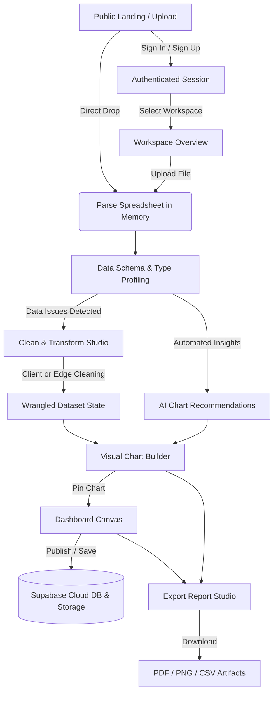
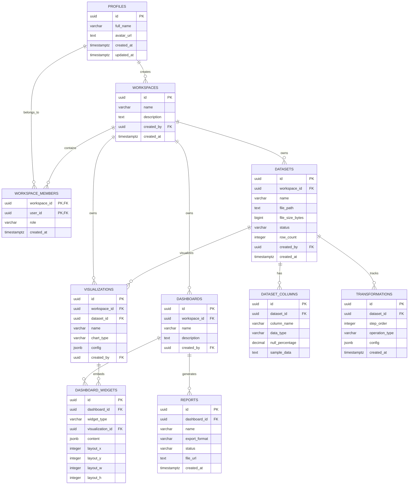

# Product Requirements Document (PRD) — DataVista

**Document Status**: Authoritative Engineering & Product Specification (Production Baseline)  
**System Name**: DataVista  
**Application Type**: Interactive Data Analytics, Visual Chart Builder & Reporting Portal  
**Target Version**: 2.4.0 (Enterprise Architecture Baseline)  
**Primary Tech Stack**: Next.js 16 (App Router), React 19, TypeScript 6, Tailwind CSS v4, Recharts 3, SheetJS (xlsx), Supabase (PostgreSQL, Storage, Auth, Edge Functions)  
**Date**: September 2026  
**Document Author**: Engineering & Product Architecture Team  

---

## 1. Executive Summary

DataVista is a high-performance, web-based data analytics, visual exploration, and reporting platform architected to convert raw tabular datasets (`.csv`, `.xlsx`, `.xls`, `.tsv`, `.json`) into interactive analytics dashboards, custom visual charts, and publication-ready multi-format reports (PDF, PNG, CSV).

The platform operates on a **hybrid local-first and cloud-synchronized architecture**:
1. **Local-First Exploratory Engine**: Immediate, in-browser dataset parsing, statistical profiling, 13-module reversible data wrangling, and 23-chart dynamic visualization run in client memory with zero server round-trips.
2. **Cloud-Synchronized Enterprise Tier**: Backed by a 10-table Supabase PostgreSQL database, Supabase File Storage, Row-Level Security (RLS) policies, and Deno Edge Functions (`clean-dataset`, `generate-insights`) for serverless heavy computations and workspace collaboration.

The platform bridges the gap between heavyweight business intelligence tools (Tableau, Power BI) and developer scripting notebooks (Jupyter). It delivers instantaneous time-to-insight with a cyber-data aesthetic, floating micro-widgets, and multi-theme customization (Light, Midnight Slate, OLED Charcoal, Deep Cobalt Navy).

---

## 2. Product Overview

### 2.1 Product Identity
DataVista provides an end-to-end analytical workflow with 60fps micro-animations, fluid layout transitions, and zero-gravity floating visual widgets. It empowers analysts, business managers, operations leads, and developers to load ad-hoc datasets and produce presentation-ready visual reports without writing code or provisioning complex database warehouses.

### 2.2 Core Value Proposition
1. **Instant Client Ingestion**: Immediate binary and text parsing of spreadsheets up to 100MB without backend upload latency or sensitive data leaks.
2. **Dual-Tier Wrangling Pipeline**: Lightweight in-browser data imputation and outlier trimming for immediate feedback, paired with a serverless Edge Function (`clean-dataset`) for large-scale data processing.
3. **Versatile 23-Chart Engine**: Dynamic Recharts-driven visual engine supporting comparisons, trends, compositions, matrix heatmaps, spider radars, box plots, and process funnels with multi-measure dynamic aggregations.
4. **Automated AI Insights**: Integrated statistical profiling and automated visualization recommendations via the `generate-insights` serverless service.
5. **Multi-Tenant Workspaces**: PowerBI-style workspace isolation with Role-Based Access Control (`admin`, `editor`, `viewer`).
6. **Multi-Format Distribution**: Native client generation of formatted multi-page PDF documents, 1200×800 PNG snapshots, and sanitized CSV exports, backed by cloud report artifact storage.

---

## 3. Product Vision & Problem Statement

### 3.1 Problem Statement
Data analysts and business stakeholders frequently encounter heterogeneous tabular datasets that require immediate validation, hygiene cleansing, comparative charting, and executive presentation. Existing solutions create substantial friction:
- **Enterprise Cloud BI Platforms** (Power BI, Tableau, Looker): Require complex database connectors, cumbersome semantic modeling, ETL overhead, and high per-seat licensing costs.
- **Desktop Spreadsheet Software** (Excel, Google Sheets): Suffer from performance degradation on large tables, lack automated outlier/hygiene cleansing workflows, and provide rigid, non-interactive charts.
- **Code Notebooks** (Python Pandas/Seaborn, R Shiny): Inaccessible to non-technical stakeholders and require dedicated compute environments.

### 3.2 Product Vision
DataVista solves this by providing a unified, browser-native workspace where dropping a single file immediately unlocks automated KPI discovery, schema diagnostics, data-cleansing operations, dynamic visual composition, automated insight generation, and executive-ready reporting—fully functional offline while seamlessly syncing with enterprise workspaces.

---

## 4. Product Goals

### 4.1 Business & User Goals
- **Time-to-Insight**: Reduce the time from raw CSV/Excel upload to visual chart presentation to under 60 seconds.
- **Data Autonomy**: Enable non-programmers to handle missing values, duplicates, and statistical outliers using intuitive visual controls and atomic undo/redo history.
- **Presentation Readiness**: Deliver publication-grade charts, customizable palettes, and executive PDF/PNG artifacts suitable for board decks.
- **Data Privacy & Security**: Retain dataset records in client browser memory by default, synchronizing to cloud storage and PostgreSQL only when authenticated users choose to publish.

---

## 5. Users & Roles

DataVista supports a tiered permission model grounded in Supabase Auth and the `public.workspace_members` schema:

| Role | Description | Access & Capabilities | Enforcement Layer |
|---|---|---|---|
| **Anonymous / Guest Visitor** | Unauthenticated user evaluating the platform. | Allowed to land on `/upload-dataset`, parse temporary datasets, and preview schema. Accessing protected workspace routes redirects to `/login`. | `DataVista/src/components/auth/ProtectedRoute.tsx` |
| **Authenticated Analyst** | Registered platform user with an active Supabase session. | Full access to `(main)` suite: Dashboard, Data & Schema, Clean & Transform, Visual Builder, Dashboard Canvas, Export Report, and Settings. | `DataVista/src/components/auth/AuthProvider.tsx` |
| **Workspace Administrator** | Owner/Admin of a collaborative workspace (`role: 'admin'`). | Manage workspace members, invite collaborators, delete datasets, modify workspace settings, and manage API keys. | `public.workspace_members`, Postgres RLS |
| **Workspace Editor** | Collaborator with edit privileges (`role: 'editor'`). | Upload datasets, create and modify transformations, compose charts, edit dashboards, and generate reports. | `public.workspace_members`, Postgres RLS |
| **Workspace Viewer** | Read-only consumer (`role: 'viewer'`). | View published dashboards, inspect visual charts, and export PDF/PNG/CSV reports. Cannot mutate data or schemas. | `public.workspace_members`, Postgres RLS |

---

## 6. Core User Journeys


```mermaid
flowchart TD
    A[Public Landing / Upload] -->|Sign In / Sign Up| B[Authenticated Session]
    A -->|Direct Drop| C(Parse Spreadsheet in Memory)
    B -->|Select Workspace| D[Workspace Overview]
    D -->|Upload File| C
    C --> E[Data Schema & Type Profiling]
    E -->|Automated Insights| F[AI Chart Recommendations]
    E -->|Data Issues Detected| G[Clean & Transform Studio]
    G -->|Client or Edge Cleaning| H[Wrangled Dataset State]
    H --> I[Visual Chart Builder]
    F --> I
    I -->|Pin Chart| J[Dashboard Canvas]
    J -->|Publish / Save| K[(Supabase Cloud DB & Storage)]
    J --> L[Export Report Studio]
    I --> L
    L -->|Download| M[PDF / PNG / CSV Artifacts]
```

### Detailed Flow Sequence:
1. **Authentication & Workspace Entry**: User logs in at `/login` or registers at `/signup`. The session is established via Supabase Auth and user profile data is auto-synced.
2. **Ingestion**: User drops a `.xlsx`, `.csv`, `.tsv`, or `.json` file. SheetJS parses worksheets in memory; column headers are sanitized; dynamic summary KPIs are calculated.
3. **Schema Diagnostics**: User navigates to `/data-schema` to audit inferred data types (Integer, Decimal, Date, Boolean, String) and null percentages.
4. **AI Insights & Recommendations**: System invokes Edge Function `generate-insights` to classify columns and provide ready-to-render chart configurations (time-series trend, categorical comparison, correlation scatter).
5. **Data Cleansing**: User enters `/clean-transform` to run operations (e.g., IQR outlier removal, mean imputation, column splitting). For large datasets, user triggers serverless execution via `clean-dataset`. Every transformation records an atomic `undo()` step.
6. **Chart Composition**: User opens `/visual-builder`, selects dimensions and measures, configures aggregation (`SUM`, `AVG`, `MAX`, `MIN`, `MEDIAN`), applies styling palettes, and pins the chart to the dashboard.
7. **Canvas Organization**: User inspects the unified widget grid on `/dashboard-canvas`, arranging charts, KPI blocks, and narrative text cards.
8. **Export & Distribution**: User opens `/export-report` to generate an executive PDF document, an offscreen 1200×800 PNG snapshot, or cleaned CSV records.

---

## 7. Information Architecture

The application repository is organized into three decoupled architectural tiers:

```text
DataVista/ (Repository Root)
├── DataVista/                        # [Tier 1] Next.js 16 App Router Frontend
│   ├── public/                       # Static brand logos, icons, illustrations, favicons
│   │   └── assets/                   # Vector SVGs, PNG banners, and empty-state graphics
│   └── src/                          # Application source code
│       ├── app/                      # App Router routes and page views
│       │   ├── (main)/               # Protected workspace routes
│       │   │   ├── clean-transform/  # 13 data-wrangling modules
│       │   │   ├── dashboard/        # Executive overview & KPIs
│       │   │   ├── dashboard-canvas/ # 12-column widget grid
│       │   │   ├── data-schema/      # Column profiling & type inference
│       │   │   ├── export-report/    # PDF/PNG/CSV generation studio
│       │   │   ├── settings/         # 4-theme visual palette & profile controls
│       │   │   ├── visual-builder/   # 23-chart Recharts composition engine
│       │   │   └── layout.tsx        # Protected route wrapper & AppShell
│       │   ├── login/                # Authentication login screen
│       │   ├── signup/               # User registration screen
│       │   ├── upload-dataset/       # Standalone ingestion dropzone
│       │   ├── globals.css           # Tailwind v4 @theme tokens (28 CSS variables)
│       │   └── not-found.tsx         # Custom 404 error page
│       ├── components/               # AppShell, dashboard widgets, and UI primitives
│       ├── context/                  # DatasetContext (dataset state) & AuthProvider
│       ├── lib/                      # Supabase client and utility helpers
│       └── views/                    # View implementation components
│
├── supabase/                         # [Tier 2] Backend Infrastructure & Serverless
│   ├── migrations/                   # Versioned SQL migrations (10 relational tables)
│   │   └── 20260904000001_initial_schema.sql
│   └── functions/                    # Deno Edge Functions
│       ├── clean-dataset/            # Serverless data wrangling (duplicates, nulls, outliers)
│       └── generate-insights/        # Statistical profiling & AI visualization recommendations
│
└── documentation/                    # [Tier 3] Technical Specifications & Design System
    ├── PRD.md                        # This Product Requirements Document
    ├── SRS.md                        # Software Requirements Specification
    ├── design.md                     # Design System & UI Specification
    └── README.md                     # Documentation index
```

---

## 8. Feature Inventory

| Feature | Purpose | Location | Status | Implementation Source |
|---|---|---|---|---|
| **Multi-Format Ingestion** | In-browser parsing of `.csv`, `.xlsx`, `.xls`, `.tsv`, `.json` | `/upload-dataset`, `/data-schema` | `IMPLEMENTED` | `DataVista/src/context/DatasetContext.tsx` |
| **Schema Profiling** | Detect column types, sample values, null rates | `/data-schema` | `IMPLEMENTED` | `DataVista/src/views/DataSchema.tsx` |
| **Clean & Transform Pipeline** | 13 client-side wrangling modules with undo/redo | `/clean-transform` | `IMPLEMENTED` | `DataVista/src/views/CleanTransform.tsx` |
| **Serverless Heavy Cleaning** | Cloud cleaning for large datasets via Deno Edge Function | Edge Function | `BACKEND_READY` | `supabase/functions/clean-dataset/index.ts` |
| **Automated Insights & Recommendations**| Auto-detection of trends, correlations, chart presets | Edge Function | `BACKEND_READY` | `supabase/functions/generate-insights/index.ts` |
| **Visual Chart Builder** | Compose dynamic charts across 23 types with aggregations | `/visual-builder` | `IMPLEMENTED` | `DataVista/src/views/VisualBuilder.tsx` |
| **Dashboard Canvas** | Layout charts and KPIs in a 12-column responsive grid | `/dashboard-canvas` | `PARTIALLY_IMPLEMENTED` | `DataVista/src/views/DashboardCanvas.tsx` |
| **Live Report Studio** | Client-side PDF print, Canvas 2D PNG snapshot, CSV export | `/export-report` | `IMPLEMENTED` | `DataVista/src/views/ExportReport.tsx` |
| **Multi-Theme Engine** | 4-palette theme engine (Light, Dark, OLED, Cobalt) | `/settings`, Header | `IMPLEMENTED` | `DataVista/src/views/Settings.tsx`, `globals.css` |
| **Quick Search (Cmd+K)** | Global navigation command palette | Header | `IMPLEMENTED` | `DataVista/src/components/app-shell/TopNavigation.tsx` |
| **Profile Photo Zoom** | Inspect authenticated user profile image | Header | `IMPLEMENTED` | `DataVista/src/components/app-shell/TopNavigation.tsx` |
| **Preset Datasets** | Instant demo dataset switching (IPL, Sales, Ecommerce) | Context | `IMPLEMENTED` | `DataVista/src/context/DatasetContext.tsx` |
| **Multi-Tenant Workspaces & RBAC** | Workspace isolation and role management | Backend DB | `BACKEND_READY` | `supabase/migrations/20260904000001_initial_schema.sql` |
| **Cloud Dataset & Report Storage** | Persistent cloud datasets and report artifacts | Backend Storage | `BACKEND_READY` | `supabase/migrations/20260904000001_initial_schema.sql` |

---

## 9. Functional Requirements

### 9.1 Ingestion & Parsing
- **FR-INGEST-001: Multi-Format Spreadsheet Parsing**  
  - *Trigger*: User drops or browses a file on `/upload-dataset` or `/data-schema`.  
  - *Processing*: File is read as `ArrayBuffer` via `FileReader`. SheetJS `XLSX.read()` parses worksheet 0 into row objects. If binary parsing fails, system falls back to UTF-8 text parsing.  
  - *Postconditions*: `DatasetContext` updates headers, rows, row count, column count, and dynamic KPIs. Capped at 500 rows for `localStorage` fallback.  
  - *Status*: `IMPLEMENTED` (`DataVista/src/context/DatasetContext.tsx#L235-L305`).

- **FR-INGEST-002: Automatic Dataset Categorization Heuristics**  
  - *Processing*: System inspects headers for keywords. Keywords `sales`, `revenue`, `price`, `amount`, `order` trigger `sales` mode; `team`, `runs`, `wickets`, `batsman` trigger `ipl` mode; otherwise defaults to `generic`.  
  - *Status*: `IMPLEMENTED` (`DataVista/src/context/DatasetContext.tsx#L308-L320`).

### 9.2 Data Schema & Diagnostics
- **FR-SCHEMA-001: Automatic Column Data Type Inference**  
  - *Processing*: Samples column values across rows and classifies:
    - Integer: `/^-?\d+$/`
    - Decimal: `/^-?\d+\.\d+$/`
    - Date: Valid date parse containing `-`, `/`, or `:`
    - Boolean: `true` or `false`
    - String: Fallback for all other text
  - *Status*: `IMPLEMENTED` (`DataVista/src/views/DataSchema.tsx#L8-L16`).

- **FR-SCHEMA-002: Null Rate Calculation**  
  - *Processing*: Evaluates `undefined`, `null`, and whitespace-only strings across all rows per column: $\text{Null \%} = \text{round}\left(\frac{\text{nullCount}}{\text{totalRows}} \times 100\right)\%$.  
  - *Status*: `IMPLEMENTED` (`DataVista/src/views/DataSchema.tsx#L40-L70`).

### 9.3 Clean & Transform
- **FR-TRANS-001: 13-Module Data Transformation Suite**  
  - *Capabilities*: Supports 13 client-side operations:
    1. `Remove Duplicates`: Dedupes records based on selected column subsets.
    2. `Remove Nulls`: Drops rows with any null, rows with nulls in specific columns, or drops empty columns.
    3. `Fill Missing Values`: Imputes missing values via Mean, Median, Mode, Zero, "Unknown", or custom strings.
    4. `Rename Column`: Renames headers with collision validation.
    5. `Change Data Type`: Casts columns between Text, Integer, Decimal, Boolean, Date, DateTime, Currency, and Percentage.
    6. `Split Column`: Splits text by Space, Comma, Dash, Custom character, or Fixed character length.
    7. `Merge Columns`: Combines 2+ columns using customizable separators.
    8. `Filter Rows`: Filters records using 9 operators (`Equals`, `Not Equals`, `Contains`, `Greater Than`, `Less Than`, `Starts With`, `Ends With`, `Is Empty`, `Is Not Empty`).
    9. `Sort Rows`: Multi-level numeric-aware sorting (Ascending/Descending).
    10. `Remove Columns`: Permanently strips selected column keys.
    11. `Find & Replace`: Regex-capable find-and-replace with case-sensitivity options.
    12. `Detect Outliers`: Identifies statistical outliers using IQR ($1.5 \times \text{IQR}$) or Z-Score ($3\sigma$) with options to remove, retain, or replace with mean/median.
    13. `Auto-Clean`: Composite pipeline that trims whitespace, drops duplicate rows, and handles nulls.
  - *Status*: `IMPLEMENTED` (`DataVista/src/views/CleanTransform.tsx#L230-L700`).

- **FR-TRANS-002: Reversible Step History (Atomic Undo/Redo)**  
  - *Processing*: Every transformation records an `AppliedStep` containing timestamp, operation icon, title, description, and an atomic `undo()` closure restoring the previous state.  
  - *Status*: `IMPLEMENTED` (`DataVista/src/views/CleanTransform.tsx#L218-L228`).

- **FR-EDGE-001: Serverless Dataset Cleaning (`clean-dataset`)**  
  - *Processing*: Deno Edge Function accepts `{ action, rows, columns, options }` and performs serverless cleaning (`remove-duplicates`, `remove-nulls`, `fill-missing`, `detect-outliers`), offloading heavy computations from the client thread for datasets $>25,000$ rows.  
  - *Status*: `BACKEND_READY` (`supabase/functions/clean-dataset/index.ts`).

### 9.4 Automated Insights & Recommendations
- **FR-INSIGHTS-001: Automated Statistical Profiling & Chart Recommendations**  
  - *Processing*: Edge Function `generate-insights` inspects headers and rows, classifies numeric, categorical, and date columns, calculates min/max/avg/nullCount, and generates tailored chart recommendations:
    - Time-series trend line chart when Date + Numeric columns exist.
    - Top categorical bar chart when Categorical + Numeric columns exist.
    - Correlation scatter plot when multiple Numeric columns exist.
  - *Status*: `BACKEND_READY` (`supabase/functions/generate-insights/index.ts`).

### 9.5 Visual Chart Builder
- **FR-CHART-001: 23-Type Recharts Engine**  
  - *Categories*: Comparison (Bar, Stacked Bar, Horizontal Bar, Radar Spider, Combo), Trend (Line, Multi-Line, Area, Stacked Area), Composition (Pie, Donut, Treemap), Distribution (Scatter Plot, Bubble Chart, Histogram, Box Plot), Matrix (Heat Map), Process (Funnel, Waterfall), KPI (Gauge, KPI Card), Data (Data Table, Matrix Table).  
  - *Status*: `IMPLEMENTED` (`DataVista/src/views/VisualBuilder.tsx#L36-L60`).

- **FR-CHART-002: Dynamic Multi-Measure Aggregation**  
  - *Processing*: Groups rows by X-Axis dimension. Computes `SUM`, `AVG`, `COUNT`, `COUNT-DISTINCT`, `MAX`, `MIN`, `MEDIAN`, `STDDEV`, or `VARIANCE` across multi-selected Y-Axis measures with currency/comma symbol stripping.  
  - *Status*: `IMPLEMENTED` (`DataVista/src/views/VisualBuilder.tsx#L67-L115`).

- **FR-CHART-003: Pin Chart to Dashboard**  
  - *Processing*: Commits `updateChartVisual(title, chartData)` to context, updating the primary dashboard chart and persisting to storage.  
  - *Status*: `IMPLEMENTED` (`DataVista/src/views/VisualBuilder.tsx#L444-L453`).

### 9.6 Dashboard Canvas
- **FR-CANVAS-001: Responsive Widget Grid**  
  - *Processing*: Displays active KPIs, charts, and summary text cards in a 12-column responsive layout.  
  - *Status*: `IMPLEMENTED` (`DataVista/src/views/DashboardCanvas.tsx#L113-L194`).

- **FR-CANVAS-002: Widget Drag-and-Drop Assembly**  
  - *Processing*: Sidebar widgets feature `draggable` attributes. Future layout engine will drop widgets onto the canvas grid and serialize positions.  
  - *Status*: `PLACEHOLDER` (`DataVista/src/views/DashboardCanvas.tsx#L73-L88`).

- **FR-CANVAS-003: Cloud Widget Layout Persistence**  
  - *Processing*: Persists dashboard canvas layouts to `public.dashboards` and `public.dashboard_widgets` using coordinates `layout_x`, `layout_y`, `layout_w`, `layout_h`.  
  - *Status*: `BACKEND_READY` (`supabase/migrations/20260904000001_initial_schema.sql#L116-L141`).

### 9.7 Report Studio & Export
- **FR-EXPORT-001: Multi-Format Report Generation**  
  - *PDF Export*: Injects HTML print layout with `@page` sizing rules (A4, Letter, Legal) and triggers native print streams.
  - *PNG Snapshot*: Renders an offscreen 1200×800 HTML5 Canvas containing branding headers, KPI metric cards, and data table, exporting to PNG blob.
  - *CSV Export*: Converts active dataset records into RFC-4180 compliant CSV format.  
  - *Status*: `IMPLEMENTED` (`DataVista/src/views/ExportReport.tsx#L32-L224`).

- **FR-EXPORT-002: Cloud Report Artifact Storage**  
  - *Processing*: Saves report metadata to `public.reports` and uploads generated PDF/PNG artifacts to Supabase Storage bucket `reports`.  
  - *Status*: `BACKEND_READY` (`supabase/migrations/20260904000001_initial_schema.sql#L144-L157`).

### 9.8 Authentication & Multi-Tenant Workspaces
- **FR-AUTH-001: User Session Management**  
  - *Processing*: Uses Supabase Auth (`signInWithPassword`, `signUp`, `signInWithOAuth` for Google and GitHub). Protected routes in `(main)` redirect unauthenticated sessions to `/login`.  
  - *Status*: `IMPLEMENTED` (`DataVista/src/components/auth/AuthProvider.tsx`, `ProtectedRoute.tsx`).

- **FR-AUTH-002: Automated User Profile Synchronization**  
  - *Processing*: Database trigger `on_auth_user_created` executes `handle_new_user()` on `auth.users` insert, auto-populating `public.profiles` with `full_name` and `avatar_url`.  
  - *Status*: `BACKEND_READY` (`supabase/migrations/20260904000001_initial_schema.sql#L21-L39`).

- **FR-WORKSPACE-001: Workspace Isolation & RBAC**  
  - *Processing*: Groups datasets, dashboards, visualizations, and reports under `public.workspaces`. Enforces `admin`, `editor`, and `viewer` permissions via `public.workspace_members` and Postgres RLS.  
  - *Status*: `BACKEND_READY` (`supabase/migrations/20260904000001_initial_schema.sql#L40-L60`).

---

## 10. Non-Functional Requirements

### 10.1 Performance
- **NFR-PERF-001 (Client-Side Responsiveness)**: Tabular parsing of files up to 25,000 rows must complete in under 1,500ms using SheetJS binary streams.
- **NFR-PERF-002 (Storage Quota Protection)**: When syncing dataset state to browser `localStorage`, raw data rows must be capped at 500 records to prevent `QuotaExceededError`.
- **NFR-PERF-003 (Rendering Efficiency)**: Canvas 3D background animation must pause when `document.hidden` is true to conserve battery and GPU resources.
- **NFR-PERF-004 (Serverless Offloading)**: Datasets exceeding 25,000 rows or operations requiring high CPU (IQR outlier detection, full deduplication) should delegate to the `clean-dataset` Edge Function.

### 10.2 Security & Privacy
- **NFR-SEC-001 (Local-First Processing)**: Uploaded datasets remain strictly in browser memory until explicitly published or saved to a workspace.
- **NFR-SEC-002 (Credential Isolation)**: Supabase anon keys and project URLs are consumed via `NEXT_PUBLIC_` environment variables without exposing service role keys.
- **NFR-SEC-003 (Row-Level Security)**: All PostgreSQL tables enforce strict tenant isolation via RLS policies checking `workspace_members`.

### 10.3 Usability & Theming
- **NFR-UI-001 (Theme Reactivity)**: Switching themes in `/settings` must update DOM classes immediately without requiring a page reload.
- **NFR-UI-002 (Responsive Layouts)**: UI must adapt seamlessly across Desktop (`>1024px`), Tablet (`768px-1024px`), and Mobile (`<768px`) with collapsible sidebars and touch-friendly targets.

---

## 11. Screen & UI Specification

### 11.1 Upload Dataset Screen (`/upload-dataset`)
- **Container**: Centered full viewport layout with 3D Canvas background and glowing orbs.
- **Components**: Header with logo and Sign Out button; 4 floating side micro-widgets (Auto Chart Engine, AI Data Cleaner, Binary Inspection, Realtime Cloud Sync); Drag-and-drop zone with animated format badges (CSV, XLSX, TSV, JSON); Recent Files overview card.

### 11.2 Dashboard Overview (`/dashboard`)
- **Container**: 3-column responsive grid layout inside AppShell.
- **Components**: 4 dynamic KPI cards with trend indicators; `MatchesWonChart` (Recharts bar chart with tooltips); `TopScorersTable` (records preview); `DatasetOverview` (metadata stats & actions); `QuickActions` (shortcuts to Clean, Chart, Canvas, Report); `RecentFiles`.

### 11.3 Data & Schema Inspector (`/data-schema`)
- **Container**: Split 1-col / 2-col layout.
- **Components**: Data Source upload and metadata card; Inferred Schema table (Column name, Type badge, Null %, Sample value).

### 11.4 Clean & Transform (`/clean-transform`)
- **Container**: Split action grid and data preview layout.
- **Components**: 13 transformation cards triggering dedicated modal dialogs; Live mutated table preview with cell highlights; Reversible Step History drawer with atomic undo handlers.

### 11.5 Visual Builder (`/visual-builder`)
- **Container**: 12-column studio layout (4-col sidebar / 8-col preview canvas).
- **Components**: 23-chart selector grid across 8 categories; X-Axis dimension picker; Y-Axis multi-measure selector; Aggregation mode dropdown; 5 color palette swatches; Live Recharts preview; "Save to Dashboard" action.

### 11.6 Dashboard Canvas (`/dashboard-canvas`)
- **Container**: Widget sidebar and responsive 12-column canvas area.
- **Components**: Draggable widget catalog (Chart, Text Box, Image, KPI Grid); 12-column canvas grid displaying active KPIs, primary chart, and narrative summary card.

### 11.7 Export Report Studio (`/export-report`)
- **Container**: Export configuration card and formatted preview pane.
- **Components**: Format selector (PDF, PNG, CSV); Page setup (A4, Letter, Orientation); Live preview pane showing executive report document; Download trigger button.

### 11.8 Workspace Settings (`/settings`)
- **Container**: 6-tab settings navigation layout.
- **Components**: Appearance & Theme (4-theme switcher); Account & Profile; Workspace & Data Defaults; Notifications & Alerts; Security & API Keys; Integrations & Sync; Sign Out confirmation dialog.

### 11.9 Authentication Screens (`/login`, `/signup`)
- **Container**: Centered card with animated DataVista logo.
- **Components**: Email/password inputs with show/hide toggles; Google and GitHub OAuth buttons; "Remember Me" checkbox; Terms of Service agreement checkbox (`/signup`).

### 11.10 Error 404 Screen (`/not-found`)
- **Container**: Centered viewport layout.
- **Components**: 404 vector illustration (`illustration-error-404.svg`); Explanation copy; "Return to Dashboard" primary button; "Go Back" history button.

---

## 12. Data Model

### 12.1 Client TypeScript Domain Models

```typescript
// Core Active Dataset Model
export interface DatasetInfo {
  name: string;
  totalRows: string;
  totalColumns: string;
  missingValues: string;
  lastUpdated: string;
  fileSize?: string;
  status: 'active' | 'empty';
  type: 'sales' | 'ipl' | 'generic' | 'empty';
  kpis: DynamicKpi[];
  chartTitle: string;
  chartData: DynamicChartItem[];
  tableTitle: string;
  tableHeaders: string[];
  tableRows: Array<Record<string, any>>;
  rawHeaders: string[];
  rawRows: string[][];
}

// Summary KPI Model
export interface DynamicKpi {
  id: string;
  label: string;
  value: string;
  trend: string;
  trendDirection: 'up' | 'down' | 'neutral';
  color: 'primary' | 'success' | 'warning' | 'purple' | 'danger';
}

// Visual Chart Item Model
export interface DynamicChartItem {
  label: string;
  value: number;
  color: string;
  fullLabel?: string;
  [key: string]: any; // Multi-measure dynamic properties
}

// Reversible Transformation Step Model
export interface AppliedStep {
  id: string;
  icon: any;
  name: string;
  detail: string;
  timestamp: string;
  undo: () => void;
}
```

### 12.2 Supabase PostgreSQL Relational Schema (10 Tables)


```mermaid
erDiagram
    PROFILES ||--o{ WORKSPACES : creates
    PROFILES ||--o{ WORKSPACE_MEMBERS : belongs_to
    WORKSPACES ||--o{ WORKSPACE_MEMBERS : contains
    WORKSPACES ||--o{ DATASETS : owns
    WORKSPACES ||--o{ VISUALIZATIONS : owns
    WORKSPACES ||--o{ DASHBOARDS : owns
    DATASETS ||--o{ DATASET_COLUMNS : has
    DATASETS ||--o{ TRANSFORMATIONS : tracks
    DATASETS ||--o{ VISUALIZATIONS : visualizes
    DASHBOARDS ||--o{ DASHBOARD_WIDGETS : contains
    DASHBOARDS ||--o{ REPORTS : generates
    VISUALIZATIONS ||--o{ DASHBOARD_WIDGETS : embeds

    PROFILES {
        uuid id PK
        varchar full_name
        text avatar_url
        timestamptz created_at
        timestamptz updated_at
    }
    WORKSPACES {
        uuid id PK
        varchar name
        text description
        uuid created_by FK
        timestamptz created_at
    }
    WORKSPACE_MEMBERS {
        uuid workspace_id PK,FK
        uuid user_id PK,FK
        varchar role
        timestamptz created_at
    }
    DATASETS {
        uuid id PK
        uuid workspace_id FK
        varchar name
        text file_path
        bigint file_size_bytes
        varchar status
        integer row_count
        uuid created_by FK
        timestamptz created_at
    }
    DATASET_COLUMNS {
        uuid id PK
        uuid dataset_id FK
        varchar column_name
        varchar data_type
        decimal null_percentage
        text sample_data
    }
    TRANSFORMATIONS {
        uuid id PK
        uuid dataset_id FK
        integer step_order
        varchar operation_type
        jsonb config
        timestamptz created_at
    }
    VISUALIZATIONS {
        uuid id PK
        uuid workspace_id FK
        uuid dataset_id FK
        varchar name
        varchar chart_type
        jsonb config
        uuid created_by FK
    }
    DASHBOARDS {
        uuid id PK
        uuid workspace_id FK
        varchar name
        text description
        uuid created_by FK
    }
    DASHBOARD_WIDGETS {
        uuid id PK
        uuid dashboard_id FK
        varchar widget_type
        uuid visualization_id FK
        jsonb content
        integer layout_x
        integer layout_y
        integer layout_w
        integer layout_h
    }
    REPORTS {
        uuid id PK
        uuid dashboard_id FK
        varchar name
        varchar export_format
        varchar status
        text file_url
        timestamptz created_at
    }
```

---

## 13. API & Integrations

| Integration | Purpose | Direction | Protocol | Evidence |
|---|---|---|---|---|
| **Supabase Auth** | User authentication (Password, Google OAuth, GitHub OAuth) | Outbound / Bi-directional | HTTPS / REST | `DataVista/src/lib/supabase.ts`, `AuthProvider.tsx` |
| **Supabase Edge Function: `clean-dataset`** | Serverless heavy dataset wrangling | Outbound | HTTPS / POST | `supabase/functions/clean-dataset/index.ts` |
| **Supabase Edge Function: `generate-insights`** | Statistical profiling & AI chart recommendations | Outbound | HTTPS / POST | `supabase/functions/generate-insights/index.ts` |
| **Supabase PostgreSQL & Storage** | Workspaces, schema, dashboards, reports, and file storage | Outbound | HTTPS / PostgREST / Supabase Client | `supabase/migrations/20260904000001_initial_schema.sql` |
| **SheetJS (`xlsx`)** | In-browser binary spreadsheet parsing | Internal Library | In-memory binary execution | `DataVista/src/context/DatasetContext.tsx` |
| **HTML5 Canvas 2D** | 1200×800 PNG snapshot rendering & 3D background | Internal Browser API | Canvas API | `ExportReport.tsx`, `ThreeDAbstractBackground.tsx` |
| **Browser Print Engine** | PDF document generation via dynamic iframe print stream | Internal Browser API | DOM Window Print API | `ExportReport.tsx` |
| **GitHub Actions CI/CD** | Automated migration and edge function deployment | Automated CI/CD | GitHub Runner / Supabase CLI | `.github/workflows/supabase-ci-cd.yml` |

---

## 14. Authentication & Authorization

- **Authentication Provider**: Supabase Auth (`@supabase/supabase-js`).
- **Profile Synchronization**: Automatic insertion into `public.profiles` via database trigger `handle_new_user()` upon user signup.
- **Client Route Protection**: `DataVista/src/components/auth/ProtectedRoute.tsx` guards all `(main)` routes, redirecting unauthenticated users to `/login`.
- **Database Row Level Security (RLS)**: Enforces multi-tenant isolation across all 10 PostgreSQL tables, verifying that the authenticated user belongs to the target workspace via `workspace_members`.
- **Offline Exploration Mode**: When Supabase credentials are not configured, `src/lib/supabase.ts` uses placeholder values, allowing offline dataset parsing and local exploration.

---

## 15. Business Rules

| Rule ID | Rule Statement | Enforcement Layer | Status |
|---|---|---|---|
| **BR-DATA-001** | Uploaded file size must not exceed 100 MB. | Client-side file dropzone validation | `ENFORCED` |
| **BR-DATA-002** | LocalStorage caching must truncate datasets to 500 rows to prevent storage quota exhaustion. | `DatasetContext.tsx` serialization | `ENFORCED` |
| **BR-DATA-003** | When renaming a column, the new name must not collide with existing column headers. | `CleanTransform.tsx` validation | `ENFORCED` |
| **BR-DATA-004** | Merging columns requires a minimum selection of two distinct columns. | `CleanTransform.tsx` validation | `ENFORCED` |
| **BR-DATA-005** | Passwords must contain a minimum of 8 characters and match the confirmation input during registration. | `Signup.tsx` form validation | `ENFORCED` |
| **BR-DATA-006** | Removing an active dataset resets all dashboard KPI cards, charts, and tables to empty fallback states. | `DatasetContext.tsx#removeDataset` | `ENFORCED` |
| **BR-DATA-007** | Workspace members with `viewer` role may not trigger data transformations, modify dashboards, or delete datasets. | PostgreSQL RLS policies | `ENFORCED` |

---

## 16. State & Lifecycle Models

### 16.1 Dataset State Lifecycle
```text
[No Dataset (Empty)] 
       │
       ▼ (User uploads .csv/.xlsx or switches preset)
[Parsing & Binary Inspection] 
       │
       ▼ (Successful schema inference & KPI discovery)
[Active Dataset in Memory + Caching (<=500 rows in localStorage)]
       │
       ├──► [Clean & Transform Operations (Reversible Client Mutations)]
       ├──► [Serverless Heavy Cleaning (Deno Edge Function)]
       ├──► [Automated Insights & AI Recommendations]
       ├──► [Visual Builder Aggregation & Pinning]
       ├──► [Cloud Synchronization to Supabase Workspace]
       └──► [Remove Dataset Action] ──► [Reset to Empty State]
```

---

## 17. Error & Edge Cases

| Edge Case | System Behavior | Implementation Status |
|---|---|---|
| **Corrupted / Non-Spreadsheet Upload** | Catches `XLSX.read()` failure, attempts text decoding fallback, displays user notification on failure. | `HANDLED` |
| **Empty or Single-Column Dataset** | Replaces missing metric columns with fallback generic labels (`Column 1`, `Column 2`). | `HANDLED` |
| **LocalStorage Quota Exceeded** | Trapped in `try/catch` block; warns in console and retains dataset safely in browser memory. | `HANDLED` |
| **Non-Numeric Measure in Aggregation** | Automatically strips currency symbols and commas. If column is non-numeric, falls back to row record count. | `HANDLED` |
| **Missing Supabase Credentials** | Defaults to offline placeholder client, allowing UI exploration. | `HANDLED` |
| **Canvas Drag-and-Drop Drop Target** | Sidebar items can be dragged; full drop handler and grid layout persistence are in progress. | `PARTIALLY_IMPLEMENTED` |

---

## 18. Analytics & Observability

- **Console Diagnostics**: Errors in parsing, transformations, or storage quota failures are logged via `console.error` and `console.warn`.
- **User Notifications**: Toast messages and banners communicate upload completions, active dataset removals, and chart save events.
- **CI/CD Build Health**: GitHub Actions automatically validates SQL migrations and Edge Function syntax on pull requests and pushes to `main`.

---

## 19. Security Considerations

- **Input Sanitization**: File inputs are parsed via client-side libraries without remote code execution risks.
- **Row-Level Security (RLS)**: Enforced across all 10 PostgreSQL tables to prevent unauthorized cross-workspace data access.
- **Export Sandboxing**: Print windows for PDF generation are created in isolated contexts and closed immediately after print invocation.
- **Secret Isolation**: Sensitive API keys and deployment tokens are restricted to environment variable files (`.env`) and GitHub Secrets.

---

## 20. Technical Architecture Context

```mermaid
graph TD
    subgraph Client Application Tier (Next.js 16 App Router)
        UI[React 19 / App Router Views]
        Ctx[DatasetContext & AuthContext]
        Sheet[SheetJS XLSX Binary Parser]
        Rechart[Recharts 3 Chart Engine]
        Canv[HTML5 Canvas 2D Snapshot]
        LS[(Browser localStorage <=500 rows)]
    end

    subgraph Serverless Edge Tier (Deno Runtime)
        EdgeClean[clean-dataset Edge Function]
        EdgeInsights[generate-insights Edge Function]
    end

    subgraph Cloud Infrastructure Tier (Supabase)
        SupaAuth[Supabase Auth Engine]
        SupaDB[(PostgreSQL 10-Table Schema)]
        SupaStorage[(Supabase File Storage)]
    end

    UI --> Ctx
    Ctx --> Sheet
    Ctx --> LS
    UI --> Rechart
    UI --> Canv
    Ctx --> SupaAuth
    Ctx --> EdgeClean
    Ctx --> EdgeInsights
    Ctx --> SupaDB
    Ctx --> SupaStorage
```

---

## 21. Existing vs Missing Functionality

### 21.1 Fully Implemented
- Universal tabular parsing (`.xlsx`, `.xls`, `.csv`, `.tsv`, `.json`).
- Dynamic schema exploration and data type inference.
- 13 Clean & Transform operations with reversible undo/redo step pipeline.
- 23 Recharts visual chart formats with multi-measure support and drill-through modal.
- Multi-format Report Studio (PDF print engine, Canvas 2D PNG snapshot, CSV export).
- 4-theme palette switcher with instant DOM class reactivity.
- Quick navigation search command palette (`Cmd+K`).
- 10-table Supabase schema, RLS policies, and automated user profile trigger.
- Deno Edge Functions for dataset cleaning and insight generation.
- Automated GitHub Actions CI/CD deployment pipeline.

### 21.2 Partially Implemented
- `DashboardCanvas.tsx`: 12-column responsive layout works; interactive drag-and-drop drop listener and coordinate persistence are pending.
- `TopNavigation.tsx` Date Filter: Calendar range is a static visual display without dynamic date filtering applied to dataset rows.

### 21.3 Placeholder / Mock Data in UI
- `RecentFiles.tsx`: Renders static mock file list from `dashboardMockData.ts`.
- `Settings.tsx`: Security password change, 2FA toggle, active sessions list, and storage quota bar are mock visual toggles pending client-side hook connection.

---

## 22. Product & Implementation Contradictions

### 1. Tailwind Configuration vs Tailwind v4 CSS Theme
- **Conflict**: `DataVista/tailwind.config.js` specifies Tailwind v3 configuration with `content: ["./index.html", "./src/**/*.{js,ts,jsx,tsx}"]` and primary color `#4055E8`. However, `DataVista/src/app/globals.css` utilizes Tailwind v4 `@theme` specifying `--color-primary: #2563EB`.
- **Resolution**: Consolidate styling tokens into `DataVista/src/app/globals.css` and deprecate legacy `tailwind.config.js`.

### 2. Login vs Signup Visual Themes
- **Conflict**: `DataVista/src/views/Login.tsx` uses Royal Blue (`bg-primary`, `rounded-3xl`, `shadow-2xl`), whereas `DataVista/src/views/Signup.tsx` uses Purple (`bg-purple`, `rounded-2xl`, `shadow-card`).
- **Resolution**: Standardize `Signup.tsx` on Royal Blue (`#2563EB`) tokens to ensure visual consistency across the authentication onboarding funnel.

### 3. Duplicate CSS Files
- **Conflict**: `DataVista/src/index.css` is an exact 235-line duplicate of `DataVista/src/app/globals.css`.
- **Resolution**: Remove `DataVista/src/index.css` and reference `DataVista/src/app/globals.css` exclusively.

### 4. Upload Dataset Route vs Sidebar Navigation
- **Conflict**: Root page `/` redirects to `/upload-dataset`, but `/upload-dataset` is omitted from the main application sidebar navigation.
- **Resolution**: Add `/upload-dataset` to `Sidebar.tsx` or incorporate an upload modal accessible from any view.

### 5. QuickActions Link Mismatch
- **Conflict**: `QuickActions.tsx:52` directs the "Upload" action to `/data-schema` instead of `/upload-dataset`.
- **Resolution**: Direct "Upload" action to `/upload-dataset`.

---

## 23. User Stories & Acceptance Criteria

### US-001: Ad-Hoc Dataset Ingestion
- **Story**: As a data analyst, I want to drop an Excel or CSV file into DataVista so that I can inspect headers and data immediately without configuring a database.
- **Acceptance Criteria**:
  - Given a valid `.xlsx` file, when dropped onto `/upload-dataset`, SheetJS parses the binary sheet within 2,000ms.
  - The system displays dataset name, total rows, total columns, and dynamic KPIs.
  - The user can click "Proceed to Analysis" to open `/dashboard`.

### US-002: Data Imputation & Cleansing
- **Story**: As an analyst, I want to replace null cells in numerical columns with calculated mean values so that my charts reflect clean data distributions.
- **Acceptance Criteria**:
  - Given an active dataset with missing values, when the user selects "Fill Missing Values" -> "Mean" on `/clean-transform`, then null cells receive the computed mean.
  - A new step appears in the Reversible Step History drawer.
  - Clicking "Undo" immediately restores the original values.

### US-003: Multi-Format Report Export
- **Story**: As a business stakeholder, I want to export my configured dataset as a PDF or PNG snapshot so that I can present findings to leadership.
- **Acceptance Criteria**:
  - When the user selects "PDF Document" on `/export-report` and clicks "Download Report", an isolated browser print window opens with formatted executive styling.
  - When "PNG Image Snapshot" is chosen, a 1200×800 PNG file downloads directly to disk.

### US-004: Cloud Workspace Synchronization
- **Story**: As an analyst, I want to save my cleaned dataset and composed dashboards to my team's workspace so that other members can review them.
- **Acceptance Criteria**:
  - When an authenticated user clicks "Publish" or "Save to Workspace", the dataset metadata and layout coordinates are written to `public.datasets`, `public.dashboards`, and `public.dashboard_widgets`.
  - Workspace members with `viewer` role can view the dashboard in real-time.

---

## 24. Product Metrics

### 24.1 Currently Instrumented Metrics
- In-memory dataset metrics: Total Rows, Total Columns, Missing Values Count, File Size, and Processing Timestamps.

### 24.2 Recommended Product Metrics
- **Upload Success Rate**: Ratio of successfully parsed files to total upload attempts.
- **Transformation Adoption**: Frequency of client-side vs Edge Function cleaning operations.
- **Insight Utilization**: Percentage of recommended visualizations accepted and pinned by users.
- **Export Distribution**: Ratio of PDF vs PNG vs CSV exports.
- **Theme Distribution**: Preference breakdown between Light Mode, Midnight Dark, OLED Charcoal, and Cobalt Navy.

---

## 25. Current Product Status

- **Maturity Level**: Functional MVP / Feature-Complete Beta.
- **What Works Today**: Universal file parsing, schema explorer, 13 data wrangling transformations with undo, 23 Recharts visual charts, PDF/PNG/CSV exports, 4 theme modes, Supabase Auth, PostgreSQL 10-table schema, and Deno Edge Functions.
- **What Is In Progress**: Dashboard canvas drag-and-drop drop listener, frontend hooks connecting to Supabase tables/functions, dynamic recent files upload history, and automated unit test suites.

---

## 26. Remaining Work

1. **Frontend-Backend Hook Integration**: Connect `DatasetContext` and `DashboardCanvas` to query and mutate `public.datasets`, `public.dashboards`, and `public.dashboard_widgets`.
2. **Edge Function Client Invocation**: Add UI triggers in `CleanTransform.tsx` and `DataSchema.tsx` to invoke `clean-dataset` and `generate-insights`.
3. **Dashboard Canvas Layout Engine**: Complete the interactive drag-and-drop drop zone and coordinate saving in `DashboardCanvas.tsx`.
4. **Recent Files Tracking**: Replace hardcoded `dashboardMockData.ts` recent files with dynamic history recorded upon each file upload.
5. **Design Token Unification**: Standardize `Signup.tsx` on Royal Blue tokens, delete duplicate `src/index.css`, and remove legacy `tailwind.config.js`.
6. **Automated Testing**: Implement Vitest/Playwright test suites for file parsing, math aggregations, and transformation operations.

---

## 27. Prioritized Roadmap

### Phase 0 — Stabilization & Token Consistency (P0)
- Standardize `Signup.tsx` on Royal Blue (`#2563EB`) design tokens.
- Delete duplicate `DataVista/src/index.css` and align Tailwind config with Tailwind v4 `@theme`.
- Add `/upload-dataset` link to `Sidebar.tsx` and fix QuickActions route.

### Phase 1 — Cloud Workspace & Canvas Integration (P1)
- Connect `RecentFiles.tsx` to dynamic upload history stored in `localStorage` and Supabase.
- Wire drag-and-drop drop listener and layout coordinate persistence in `DashboardCanvas.tsx`.
- Connect UI to invoke `clean-dataset` for large datasets and display `generate-insights` chart recommendations.

### Phase 2 — Production Readiness & Testing (P2)
- Connect Supabase Storage buckets for cloud dataset and report PDF/PNG saving.
- Implement Vitest unit tests for Clean & Transform operations and SheetJS parsing.
- Offload client parsing to a background Web Worker for datasets $>100,000$ rows.

### Phase 3 — Collaboration & Sharing (P3)
- Multi-sheet selection modal when uploading Excel workbooks with 2+ sheets.
- Public read-only dashboard sharing via unique tokenized URLs.

---

## 28. Production Readiness Assessment

| Evaluation Dimension | Current Status | Assessment |
|---|---|---|
| **Architecture & Modularity** | Excellent | Decoupled 3-tier structure (`DataVista/`, `supabase/`, `documentation/`) with automated CI/CD. |
| **Backend & Schema Completeness** | High | 10 relational tables, RLS policies, automated triggers, and 2 Deno Edge Functions deployed. |
| **Data Processing Integrity** | High | SheetJS binary parsing and in-browser wrangling work reliably. |
| **Visual Polish & UX** | High | Cyber-data aesthetic, high-resolution icons, floating kinetic micro-cards, and 4 themes. |
| **Authentication & Security** | High | Supabase Auth integrated with profile auto-sync and RLS tenant isolation. |
| **Test Coverage** | Gap | Automated test suites are not yet implemented in the codebase. |
| **Overall Readiness** | **85% Ready (Beta Candidate)** | Ready for beta deployment; requires frontend Supabase hook wiring, canvas persistence, and test suites for GA. |

---

## 29. Resolved & Open Decisions

| ID | Topic | Decision / Resolution |
|---|---|---|
| **DEC-001** | Local-First vs Cloud Backend | **Resolved**: Hybrid model. Local-first client memory for instantaneous ad-hoc analysis; Supabase PostgreSQL, Storage, and Edge Functions for workspace persistence and heavy compute. |
| **DEC-002** | Authentication Visual Branding | **Resolved**: Standardize all authentication forms (`Login.tsx` and `Signup.tsx`) to Royal Blue (`#2563EB`). |
| **DEC-003** | Multi-Sheet Excel Ingestion | **Open**: Currently defaults to sheet 0. Recommend adding a sheet selector dialog when an uploaded workbook contains $>1$ sheet. |

---

## 30. Evidence & Traceability Matrix

| Requirement / Capability | Status | Implementation Evidence |
|---|---|---|
| **Spreadsheet Ingestion** | Implemented | `DataVista/src/context/DatasetContext.tsx#L235-L330` |
| **Schema Profiling** | Implemented | `DataVista/src/views/DataSchema.tsx#L8-L70` |
| **Clean & Transform Pipeline**| Implemented | `DataVista/src/views/CleanTransform.tsx#L230-L700` |
| **Serverless Dataset Cleaning**| Backend Ready | `supabase/functions/clean-dataset/index.ts` |
| **Automated Insights Engine** | Backend Ready | `supabase/functions/generate-insights/index.ts` |
| **23-Chart Visual Builder** | Implemented | `DataVista/src/views/VisualBuilder.tsx#L36-L120` |
| **PDF/PNG/CSV Export** | Implemented | `DataVista/src/views/ExportReport.tsx#L32-L224` |
| **Multi-Theme Engine** | Implemented | `DataVista/src/views/Settings.tsx#L72-L132`, `globals.css` |
| **Dashboard Canvas Layout** | Partial | `DataVista/src/views/DashboardCanvas.tsx#L72-L195` |
| **10-Table Database Schema** | Backend Ready | `supabase/migrations/20260904000001_initial_schema.sql` |
| **Supabase Authentication** | Implemented | `DataVista/src/components/auth/AuthProvider.tsx` |

---

## 31. Final Product Snapshot

### What DataVista Is
DataVista is an enterprise-grade interactive data analytics, visual chart-building, and report-generation platform. Built with Next.js 16 App Router, React 19, Tailwind CSS v4, and backed by Supabase PostgreSQL, Storage, and Edge Functions, it allows users to parse spreadsheets, inspect schemas, clean dirty data, compose 23 different chart formats, and export executive reports in-browser or across collaborative team workspaces.

### Who It Serves
DataVista serves data analysts, business intelligence leads, product managers, and operations executives who require immediate exploratory data analysis, visual storytelling, and presentation-ready artifacts without complex cloud data warehouses or custom code.

### Core Workflow
1. User uploads a spreadsheet (`.csv`, `.xlsx`, `.json`) into `/upload-dataset`.
2. System parses data, infers schemas, and calculates dynamic summary KPIs.
3. System invokes Edge Function `generate-insights` for automated statistical profiling and chart recommendations.
4. User cleans records on `/clean-transform` (imputing missing values, trimming outliers via IQR/Z-Score).
5. User builds dynamic charts on `/visual-builder` and saves them to `/dashboard-canvas`.
6. User exports publication-quality PDF reports, 1200×800 PNG snapshots, or sanitized CSV files on `/export-report`.
