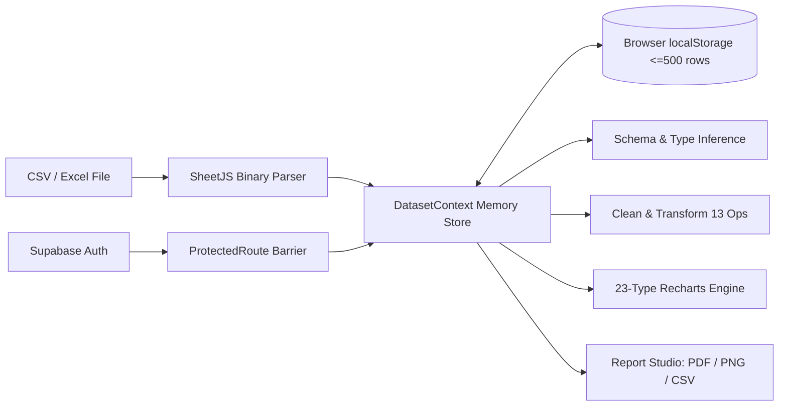
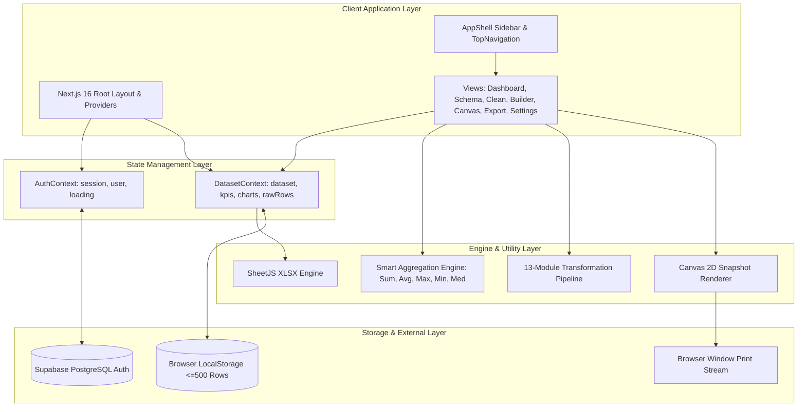
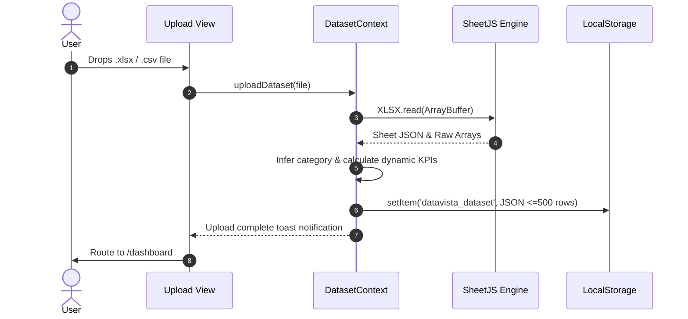
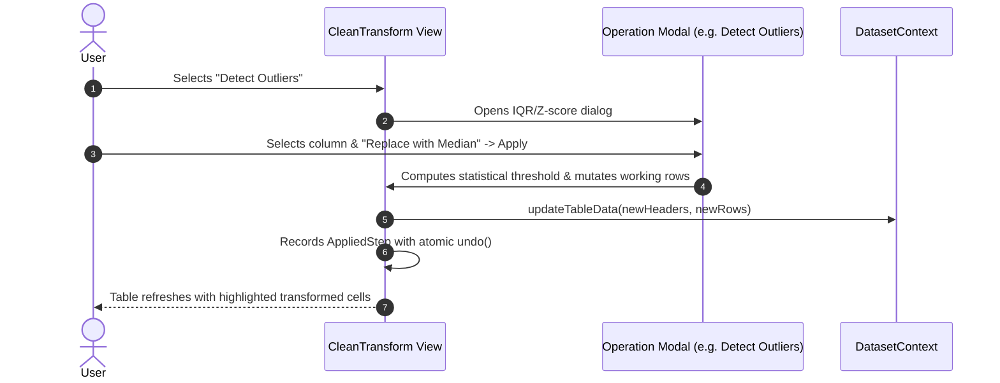
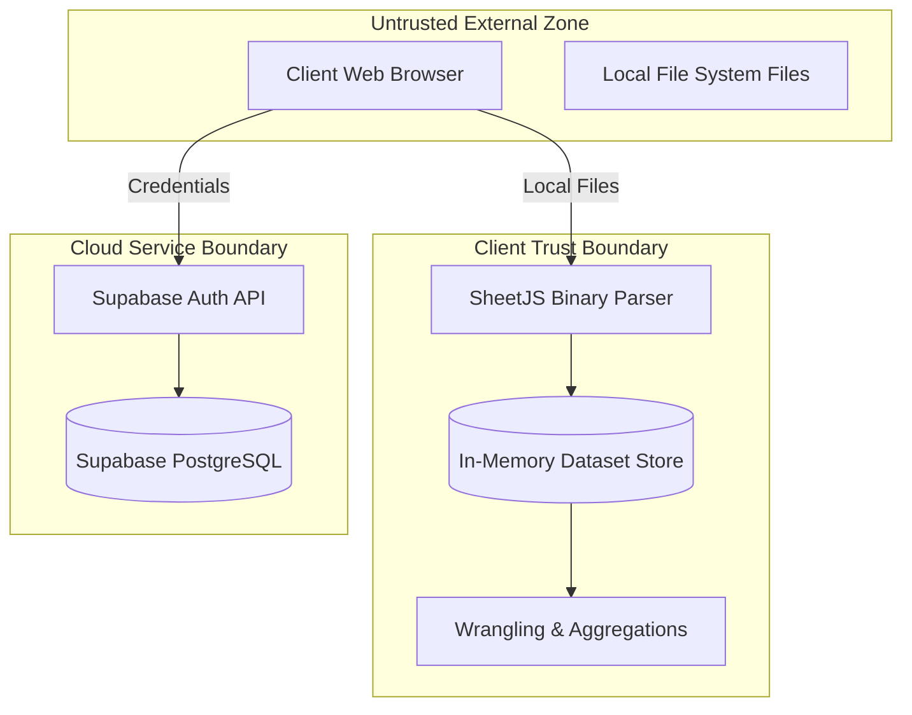

# Software Requirements Specification (SRS) — DataVista

**Document Status**: Implementation-Grounded Reverse-Engineered Engineering Specification  
**System Name**: DataVista  
**Version**: 1.0.0-rev  
**Target Release**: v2.4.0  
**Date**: September 2026  
**Author**: AI Reverse-Engineering Analysis  
**Repository Source**: `tanaydas-mopo/DataVista`  

---

## 1. Document Control

| Property | Value |
|---|---|
| **Document Title** | Software Requirements Specification for DataVista Analytics Portal |
| **System Name** | DataVista |
| **Document Purpose** | Comprehensive technical and functional baseline reverse-engineered from source repository |
| **Implementation Maturity** | Functional MVP / Feature-Complete Beta |
| **Target Audience** | Software Engineers, Architects, QA Engineers, Product Owners, AI Coding Agents |
| **Primary Frameworks** | Next.js 16.3.4 (App Router), React 19.2.7, TypeScript 6.0.2, Tailwind CSS 4.3.3 |

---

## 2. Introduction

### 2.1 Purpose
This Software Requirements Specification (SRS) establishes the formal engineering requirements, structural architecture, operational constraints, interfaces, data models, and verification criteria for **DataVista**. It serves as an authoritative technical reference for engineers maintaining, testing, and expanding the platform.

### 2.2 Scope
DataVista is an in-browser tabular data processing, visual analytics, and reporting platform. The scope includes:
- Multi-format file ingestion (`.csv`, `.xlsx`, `.xls`, `.tsv`, `.json`).
- Dynamic schema exploration, data type inference, and statistical profiling.
- In-memory data wrangling pipeline with 13 operations and reversible step history.
- Dynamic charting engine supporting 23 visualization types with multi-measure mapping.
- Freeform dashboard layout composition and synchronization.
- Multi-format report export generation (PDF print layouts, Canvas 2D PNG snapshots, sanitized CSV dumps).
- Supabase session authentication and 4-theme visual styling.

### 2.3 Intended Audience
- **Full-Stack Developers**: Guiding API integration, state management, and component development.
- **QA & Test Engineers**: Deriving test matrices, regression suites, and boundary conditions.
- **Architects & DevOps**: Evaluating local-first state persistence, build pipelines, and cloud dependencies.
- **AI Coding Agents**: Providing unambiguous system context to prevent hallucinations.

### 2.4 Definitions, Acronyms, and Abbreviations
- **SheetJS (`xlsx`)**: Client-side JavaScript library for parsing spreadsheet binary formats.
- **Recharts**: Declarative charting library built on React components and SVG elements.
- **App Router**: Next.js 16 directory-based routing architecture utilizing React Server Components and client boundaries.
- **IQR**: Interquartile Range ($Q_3 - Q_1$), used for outlier detection ($1.5 \times \text{IQR}$).
- **Z-Score**: Standard deviation distance from the mean ($\frac{x - \mu}{\sigma}$), thresholded at $\pm 3\sigma$.
- **Supabase**: Backend-as-a-Service providing PostgreSQL authentication and database listeners.

### 2.5 References
- Repository Codebase: `src/`, `public/`, `package.json`, `next.config.ts`, `globals.css`
- Architecture Documentation: `README.md`, `design.md`, `public/assets/README.md`

---

## 3. System Overview

DataVista is architected around a **local-first, memory-resident data pipeline**. Tabular datasets uploaded by the user are parsed into JavaScript memory arrays within `DatasetContext`. All transformations, filter queries, dynamic aggregations, and chart renders occur client-side on the user's hardware.



---

## 4. Product/System Context

### 4.1 Operational Environment
DataVista operates primarily within modern ECMAScript-compliant web browsers (Chrome, Firefox, Safari, Edge) on desktop, tablet, and mobile displays. It communicates over HTTPS with Supabase authentication endpoints and external avatar CDNs (`unavatar.io`).

### 4.2 Data Flow Boundaries
- **Inbound Data**: Spreadsheets, text files, or JSON dumps supplied via HTML5 Drag-and-Drop or File Picker.
- **Internal Processing**: In-memory array manipulation, regex type matching, IQR/Z-score computation, SVG rendering, and Canvas 2D rasterization.
- **Outbound Data**: Client-side generated file downloads (`.csv`, `.png`), browser print streams (`.pdf`), and Supabase authentication tokens.

---

## 5. Stakeholders and Actors

| Actor | Description | Responsibilities | Permissions | Evidence |
|---|---|---|---|---|
| **Anonymous Visitor** | Unauthenticated user accessing the platform | Evaluate landing page, test temporary ingestion | Access `/upload-dataset`, `/login`, `/signup`, `/not-found` | `src/app/page.tsx`, `ProtectedRoute.tsx` |
| **Authenticated Analyst** | Primary end user with active Supabase session | Ingest datasets, clean data, build charts, export reports | Full access to all `/dashboard`, `/clean-transform`, `/visual-builder`, `/export-report` views | `src/app/(main)/layout.tsx` |
| **Workspace Administrator** | Evidenced administrative profile | Manage workspace preferences, security settings, API connections | Access `/settings` and account controls | `src/views/Settings.tsx` |
| **Supabase Auth Service** | External identity provider | Issue JWTs, manage session lifecycle, execute OAuth handshakes | External authorization authority | `src/lib/supabase.ts` |

---

## 6. Assumptions, Constraints, and Dependencies

### 6.1 Assumptions
- End users operate modern browsers with HTML5 Canvas, File API, and Web Storage support.
- Uploaded tabular files contain clean single-table or first-sheet datasets.

### 6.2 Constraints
- **Client Storage Quota**: Web Storage (`localStorage`) is typically restricted to 5MB–10MB per origin; DataVista constrains cached raw rows to 500 records to prevent storage errors.
- **Single-Threaded Execution**: Large files (>50MB) are processed on the browser's main thread; workers are not currently implemented.
- **Offline Auth Mode**: When Supabase credentials are not supplied, authentication defaults to placeholder mode, restricting production cloud persistence.

### 6.3 Dependencies
- `next`: `^16.3.4`
- `react`: `^19.2.7`
- `xlsx`: `^0.18.5` (SheetJS)
- `recharts`: `^3.10.0`
- `lucide-react`: `^1.25.0`
- `@supabase/supabase-js`: `^2.110.8`
- `tailwindcss`: `^4.3.3`

---

## 7. System Architecture Context

### 7.1 Multi-Layer Architecture
DataVista implements a four-tier client-centric architecture:
1. **Presentation Tier**: Next.js 16 App Router pages and React 19 functional views (`src/views/`).
2. **Component Tier**: Modular domain widgets (`src/components/dashboard/`, `clean-transform/`, `visual-builder/`, `ui/`).
3. **State & Domain Tier**: React Context providers (`DatasetContext`, `AuthProvider`) managing in-memory stores and localStorage synchronization.
4. **Data & Integration Tier**: SheetJS binary parser, HTML5 Canvas 2D engine, and Supabase JS client.



---

## 8. Functional Requirements

### 8.1 Domain: Ingestion & Parsing (`INGEST`)

#### FR-INGEST-001: Binary & Text Spreadsheet Parsing
- **Description**: The system shall parse uploaded spreadsheet and tabular data files client-side into structured JavaScript objects.
- **Actor**: Anonymous Visitor / Authenticated Analyst.
- **Trigger**: File drop on dropzone or selection via file browser input.
- **Preconditions**: File is readable via HTML5 `FileReader`.
- **Inputs**: `File` object (`.csv`, `.xlsx`, `.xls`, `.tsv`, `.json`).
- **Processing**:
  1. Read file as binary `ArrayBuffer`.
  2. Invoke `XLSX.read(new Uint8Array(buffer), { type: 'array' })`.
  3. Extract worksheet 0 and invoke `XLSX.utils.sheet_to_json(worksheet, { header: 1 })`.
  4. Sanitize headers, removing non-printable characters (`/\uFFFD/g`).
  5. Fallback: If headers are empty, decode buffer via UTF-8 `TextDecoder` and split on commas/tabs/semicolons.
- **Outputs**: `DatasetInfo` state object populated with headers, raw rows, row counts, and auto-generated KPIs.
- **Postconditions**: Dataset saved to React state and serialized to `localStorage` (capped at 500 rows).
- **Status**: `IMPLEMENTED` (`src/context/DatasetContext.tsx#L235-L305`).
- **Confidence**: High.

#### FR-INGEST-002: Dynamic KPI Discovery
- **Description**: The system shall automatically compute 4 summary KPI metric cards from parsed records upon upload.
- **Processing**: Identifies primary metric columns (sales, revenue, runs, or general count), sums numerical values, calculates averages, and formats currency/record labels.
- **Status**: `IMPLEMENTED` (`src/context/DatasetContext.tsx#L370-L420`).
- **Confidence**: High.

---

### 8.2 Domain: Schema & Profiling (`SCHEMA`)

#### FR-SCHEMA-001: Automatic Column Data Type Inference
- **Description**: The system shall inspect column sample values across rows and classify them into precise semantic types.
- **Inputs**: Column string values.
- **Rules**:
  - `Integer`: Match `/^-?\d+$/`
  - `Decimal`: Match `/^-?\d+\.\d+$/`
  - `Date`: Valid date string parse containing `-`, `/`, or `:`
  - `Boolean`: Case-insensitive `true` or `false`
  - `String`: Fallback for all other text
- **Outputs**: Data type badge rendered per column in schema inspector.
- **Status**: `IMPLEMENTED` (`src/views/DataSchema.tsx#L8-L16`).
- **Confidence**: High.

#### FR-SCHEMA-002: Missing Value Completeness Profiling
- **Description**: The system shall calculate the percentage of missing or null values for each column.
- **Calculation**: $\text{Null \%} = \text{round}\left(\frac{\text{nullCount}}{\text{totalRows}} \times 100\right)\%$.
- **Status**: `IMPLEMENTED` (`src/views/DataSchema.tsx#L59-L63`).
- **Confidence**: High.

---

### 8.3 Domain: Clean & Transform (`TRANS`)

#### FR-TRANS-001: Deduplication
- **Description**: The system shall identify and purge identical rows across a user-selected subset of columns.
- **Status**: `IMPLEMENTED` (`src/views/CleanTransform.tsx#L231-L253`).
- **Confidence**: High.

#### FR-TRANS-002: Missing Value Imputation
- **Description**: The system shall impute null or empty cells using Mean, Median, Mode, Zero, "Unknown", or user-specified custom strings.
- **Status**: `IMPLEMENTED` (`src/views/CleanTransform.tsx#L304-L334`).
- **Confidence**: High.

#### FR-TRANS-003: Statistical Outlier Detection & Treatment
- **Description**: The system shall detect numerical outliers using Interquartile Range ($1.5 \times \text{IQR}$) or Z-Score ($3\sigma$) and provide actions to remove, retain, or replace with mean/median.
- **Status**: `IMPLEMENTED` (`src/views/CleanTransform.tsx#L658-L720`).
- **Confidence**: High.

#### FR-TRANS-004: Reversible Transformation Step History
- **Description**: The system shall maintain an append-only pipeline of applied transformations with atomic `undo()` closures.
- **Status**: `IMPLEMENTED` (`src/views/CleanTransform.tsx#L218-L228`).
- **Confidence**: High.

---

### 8.4 Domain: Visual Chart Builder (`CHART`)

#### FR-CHART-001: 23 Chart Types Rendering
- **Description**: The system shall render 23 chart configurations using Recharts SVG and custom SVG/HTML components.
- **Categories**: Comparison (Bar, Stacked Bar, Horizontal Bar, Radar, Combo), Trend (Line, Multi-Line, Area, Stacked Area), Composition (Pie, Donut, Treemap), Distribution (Scatter, Bubble, Histogram, Box Plot), Process (Funnel, Waterfall), KPI (Gauge, KPI Card), Data (Data Table, Matrix Table).
- **Status**: `IMPLEMENTED` (`src/views/VisualBuilder.tsx#L36-L60, L700-L950`).
- **Confidence**: High.

#### FR-CHART-002: Multi-Measure Dynamic Aggregation
- **Description**: The system shall compute dynamic aggregations across multi-selected Y-Axis measures grouped by the X-Axis dimension.
- **Supported Aggregations**: `SUM`, `AVG`, `COUNT`, `COUNT-DISTINCT`, `MAX`, `MIN`, `MEDIAN`, `STDDEV`, `VARIANCE`.
- **Status**: `IMPLEMENTED` (`src/views/VisualBuilder.tsx#L67-L115`).
- **Confidence**: High.

#### FR-CHART-003: Pin to Dashboard Canvas
- **Description**: The user shall be able to save custom configured charts to the primary dashboard view.
- **Status**: `IMPLEMENTED` (`src/views/VisualBuilder.tsx#L444-L453`).
- **Confidence**: High.

---

### 8.5 Domain: Report Studio & Export (`EXPORT`)

#### FR-EXPORT-001: PDF Document Generation
- **Description**: The system shall generate an executive PDF document using dynamic `@page` CSS print styling via an isolated print stream.
- **Status**: `IMPLEMENTED` (`src/views/ExportReport.tsx#L143-L220`).
- **Confidence**: High.

#### FR-EXPORT-002: Canvas 2D PNG Snapshot
- **Description**: The system shall render a 1200×800 pixel graphical snapshot of the dataset summary, KPIs, and table onto an offscreen HTML5 Canvas and trigger download.
- **Status**: `IMPLEMENTED` (`src/views/ExportReport.tsx#L55-L142`).
- **Confidence**: High.

#### FR-EXPORT-003: Structured CSV Export
- **Description**: The system shall export the active (or wrangled) dataset records as an RFC-4180 compliant CSV file.
- **Status**: `IMPLEMENTED` (`src/views/ExportReport.tsx#L37-L54`).
- **Confidence**: High.

---

### 8.6 Domain: Dashboard Canvas (`CANVAS`)

#### FR-CANVAS-001: Responsive Widget Grid Display
- **Description**: The system shall present active dataset KPIs, charts, and textual summaries within a 12-column responsive layout grid.
- **Status**: `IMPLEMENTED` (`src/views/DashboardCanvas.tsx#L113-L194`).
- **Confidence**: High.

#### FR-CANVAS-002: Drag-and-Drop Freeform Assembly
- **Description**: The system shall permit users to drag widget primitives from the sidebar onto the canvas to construct custom dashboard layouts.
- **Status**: `PLACEHOLDER` (`src/views/DashboardCanvas.tsx#L73-L88` has `draggable` items, but drop target handlers and layout persistence are not yet wired).
- **Confidence**: High.

---

## 9. Functional Requirement Domains

```text
DataVista Functional Domains
├── INGEST  : Multi-format parsing, schema inference, heuristic categorization
├── SCHEMA  : Statistical column profiling, null rate evaluation, sample previews
├── TRANS   : 13 wrangling modules, regex substitution, outlier pruning, undo/redo
├── CHART   : 23 Recharts visualizations, multi-measure mapping, drill-through
├── CANVAS  : Unified dashboard grid assembly, widget layout, preview
├── EXPORT  : Browser print PDF stream, Canvas 2D PNG rasterizer, CSV downloader
├── AUTH    : Supabase email/password, OAuth provider flow, route guarding
└── PREF    : 4-theme palette switcher, startup route defaults, visual effects
```

---

## 10. Detailed User/System Workflows

### 10.1 Ingestion & Profiling Workflow


### 10.2 Clean & Transform Workflow


---

## 11. UI and Interface Requirements

### 11.1 Navigation Layout
- **Desktop Sidebar**: Fixed left column (`w-[220px]`), collapsible to icon-only mode (`w-[72px]`), featuring DataVista vector logo, 7 navigation links, and expand/collapse arrow toggle.
- **Mobile Header**: Top header (`h-16`) with hamburger menu trigger, opening an off-canvas drawer (`z-50`) overlayed on `bg-slate-900/50`.
- **Global Header**: Top bar (`h-16`) containing user welcome text, `Cmd+K` global search input with autocomplete dropdown, date range badge, filter trigger, notification bell, and user avatar with click-to-zoom modal.

### 11.2 Screen Requirements (11 Primary Views)
1. **Upload Dataset (`/upload-dataset`)**: Ingestion dropzone with format badges, floating side micro-cards, and active file manager.
2. **Dashboard Overview (`/dashboard`)**: 4 KPI cards, `MatchesWonChart`, `TopScorersTable`, `DatasetOverview`, `QuickActions`, and `RecentFiles`.
3. **Data & Schema (`/data-schema`)**: Data source management card and column profiling table with type badges.
4. **Clean & Transform (`/clean-transform`)**: 13 operation modal buttons, live table preview, and transformation history drawer.
5. **Visual Builder (`/visual-builder`)**: 23-chart selector grid, X/Y axes configuration, aggregation selector, filter modal, and Recharts preview.
6. **Dashboard Canvas (`/dashboard-canvas`)**: Widget sidebar, 12-column canvas grid displaying active KPIs and charts.
7. **Export Report (`/export-report`)**: Format radio selection (PDF, PNG, CSV), page setup, live preview pane, and download button.
8. **Settings (`/settings`)**: 6-tab sidebar, 4-theme palette cards, default startup dropdown, and sign-out confirmation dialog.
9. **Login (`/login`)**: Centered Royal Blue themed authentication card with password visibility toggles and OAuth buttons.
10. **Signup (`/signup`)**: Centered Purple themed registration card with password confirmation and Terms checkbox.
11. **Not Found (`/not-found`)**: 404 vector illustration, error message, and return-to-dashboard CTA.

---

## 12. External Interface Requirements

| Interface | Protocol | Request Payload | Response | Error Handling | Status |
|---|---|---|---|---|---|
| **Supabase Auth** | HTTPS / REST | `{ email, password }` or OAuth redirect | Session JWT, User object | Error message rendered in red alert banner | `IMPLEMENTED` |
| **Unavatar CDN** | HTTPS GET | `https://unavatar.io/{email}` | JPEG/PNG avatar image stream | Fallback to initials avatar on `onError` | `IMPLEMENTED` |
| **Browser Print** | Native DOM API | Generated HTML string in `window.open` | System print dialog stream | Caught in try/catch; triggers toast alert | `IMPLEMENTED` |

---

## 13. Internal API Requirements

DataVista operates as a Next.js App Router Single-Page Application without bespoke `/api/` server route endpoints. All communication occurs through React Context functions:

| Function | Module | Parameters | Description | Status |
|---|---|---|---|---|
| `uploadDataset` | `DatasetContext` | `file: File` | Ingests, parses, profiles, and caches dataset | `IMPLEMENTED` |
| `removeDataset` | `DatasetContext` | `void` | Clears active dataset and resets to empty fallback | `IMPLEMENTED` |
| `updateChartVisual`| `DatasetContext` | `title: string, data: DynamicChartItem[]` | Pins configured chart to dashboard view | `IMPLEMENTED` |
| `updateTableData` | `DatasetContext` | `headers: string[], rows: Record<string, any>[]`| Commits wrangled table data to context and storage | `IMPLEMENTED` |
| `switchDatasetPreset`| `DatasetContext` | `preset: 'ipl' \| 'sales' \| 'ecommerce'` | Loads pre-configured demo datasets | `IMPLEMENTED` |

---

## 14. Authentication Requirements

- **Email & Password**: Handled via `supabase.auth.signInWithPassword()` and `supabase.auth.signUp()`.
- **Social OAuth**: Supports Google and GitHub providers via `supabase.auth.signInWithOAuth()`.
- **Session Persistence**: Automated through Supabase client local session management.
- **Route Guard**: Client-side `ProtectedRoute` wraps `(main)/layout.tsx`, redirecting unauthenticated sessions to `/login`.

---

## 15. Authorization Requirements

- **Client-Side Enforcement**: Authenticated users have unrestricted access to all dashboard tools.
- **No Multi-Tenant Isolation**: In the current MVP, dataset records are strictly local to the user's browser session. No organization-level permission checks or RBAC restrictions are enforced in the client code.

---

## 16. Data Requirements

### 16.1 Entity Definitions

#### Entity: `DatasetInfo`
| Field | Type | Required | Default | Purpose |
|---|---|---|---|---|
| `name` | String | Yes | `""` | File name of active dataset |
| `totalRows` | String | Yes | `"-"` | Formatted record count (e.g. `"15,600"`) |
| `totalColumns` | String | Yes | `"-"` | Column count |
| `missingValues`| String | Yes | `"0"` | Total missing value tally |
| `lastUpdated` | String | Yes | `"-"` | Formatted ingestion timestamp |
| `status` | Enum | Yes | `'empty'` | Status flag (`'active'` \| `'empty'`) |
| `type` | Enum | Yes | `'empty'` | Heuristic domain (`'sales'` \| `'ipl'` \| `'generic'` \| `'empty'`) |
| `kpis` | Array | Yes | `[]` | Dynamic summary metrics |
| `chartData` | Array | Yes | `[]` | Formatted chart items for Recharts |
| `tableHeaders` | String[] | Yes | `[]` | Active column keys |
| `tableRows` | Object[] | Yes | `[]` | Active row records |
| `rawHeaders` | String[] | Yes | `[]` | Ingested column keys |
| `rawRows` | String[][] | Yes | `[]` | Ingested matrix data |

---

## 17. Data Lifecycle Requirements

```text
[Dataset Lifecycle]
File Ingested 
    └──► Binary Parsed into Memory 
             └──► Statistical Profiling (Types & Nulls)
                      └──► Wrangled (Mutations with Undo)
                               └──► Visualized (Chart Aggregation)
                                        └──► Exported (PDF/PNG/CSV)
                                                 └──► Removed (Reset to Empty)
```

---

## 18. Business Rules

- **BR-ENG-001**: LocalStorage data must not exceed 500 rows to prevent browser quota overflow.
- **BR-ENG-002**: Numerical aggregations must ignore non-numerical characters (e.g. `$`, `,`) before calculation.
- **BR-ENG-003**: When casting column types, rows failing parsing must preserve their original value with error cell highlighting.
- **BR-ENG-004**: Removing an active dataset must clear all pinned charts, KPIs, and table records immediately.

---

## 19. State Management Requirements

- **`DatasetContext`**: Single source of truth for the active dataset, table records, and chart visuals.
- **`AuthContext`**: Manages Supabase session tokens, user profile metadata, and loading state.
- **Theme State**: Persisted in `localStorage.getItem('datavista_theme')` and reflected on the `<html>` element as CSS classes (`dark`, `extra-dark`, `cobalt-dark`).
- **Sidebar State**: Persisted in `localStorage.getItem('datavista_sidebar_collapsed')` (`true` \| `false`).

---

## 20. Validation Requirements

- **File Upload**: Restricts file extensions to `.csv`, `.xlsx`, `.xls`, `.tsv`, `.json`, `.sqlite`, `.db` with a 100MB maximum size.
- **User Registration**: Enforces email format, password minimum length of 8 characters, password confirmation matching, and mandatory Terms of Service acceptance.
- **Column Operations**: Rejects empty column names, duplicate column headers, and splits with undefined delimiters.

---

## 21. Error Handling Requirements

- **Parsing Failures**: If SheetJS fails to parse binary data, the system falls back to a UTF-8 text parser. If text parsing also fails, a red notification toast is rendered.
- **Storage Errors**: `localStorage` writes are wrapped in `try/catch` blocks; quota exhaustion logs a warning and retains data in memory.
- **Unauthenticated Navigation**: Unauthorized requests to `/dashboard` trigger immediate redirection to `/login`.
- **404 Route Catch**: All undefined paths route to `src/app/not-found.tsx` with a return link.

---

## 22. Loading, Empty, and Success-State Requirements

- **Loading States**:
  - Global auth checking: Full-screen centered blue spinning loader.
  - File parsing: Progress indicator on "Proceed to Analysis" button.
  - Report download: "Generating Report..." button spinner.
- **Empty States**:
  - Empty Dashboard: `illustration-empty-dashboard.svg` with upload CTA.
  - Empty Data Table: `illustration-empty-data.svg`.
  - Empty Chart Builder: `illustration-empty-chart.svg`.
- **Success States**:
  - Transformed cells: Emerald toast notifications and visual cell highlights.
  - Export success: Green badge toast confirming file download.

---

## 23. Non-Functional Requirements

### 23.1 Performance (`NFR-PERF`)
- **NFR-PERF-001**: Initial page load bundle size must remain under 350KB gzipped.
- **NFR-PERF-002**: In-browser filtering and sorting of up to 10,000 rows must complete in under 200ms.

### 23.2 Security (`NFR-SEC`)
- **NFR-SEC-001**: Datasets must never be sent to external network destinations without explicit user configuration.
- **NFR-SEC-002**: Password fields must feature masked inputs with show/hide toggle controls.

### 23.3 Reliability & Availability (`NFR-REL`)
- **NFR-REL-001**: The platform must operate offline for ingestion, wrangling, charting, and exporting even if Supabase is unreachable.

### 23.4 Accessibility (`NFR-ACC`)
- **NFR-ACC-001**: Interactive buttons and inputs must support standard keyboard navigation (`Tab`, `Enter`, `Space`) and visible focus rings.

### 23.5 Compatibility (`NFR-COMP`)
- **NFR-COMP-001**: Fully functional across Chrome 110+, Safari 16+, Firefox 110+, and Edge 110+.

### 23.6 Maintainability (`NFR-MAINT`)
- **NFR-MAINT-001**: Codebase must pass `oxlint src` inspection with zero errors.

---

## 24. Security and Trust Boundaries



---

## 25. Configuration Requirements

| Variable Name | Required | Used By | Default / Fallback |
|---|---|---|---|
| `NEXT_PUBLIC_SUPABASE_URL` | Optional | `src/lib/supabase.ts` | `'https://placeholder-project.supabase.co'` |
| `NEXT_PUBLIC_SUPABASE_ANON_KEY` | Optional | `src/lib/supabase.ts` | `'placeholder-anon-key'` |
| `NEXT_PUBLIC_SUPABASE_PUBLISHABLE_KEY` | Optional | `src/lib/supabase.ts` | Alternative anon key format |

---

## 26. Deployment Requirements

- **Runtime**: Node.js 18.18+ or Node.js 20+.
- **Build Command**: `next build` generating standalone static routes and client bundles.
- **Start Command**: `next start` on port 3000.
- **Hosting Targets**: Vercel, Netlify, Docker container, or self-hosted Node server.

---

## 27. Testing Requirements

### 27.1 Current State
- No automated unit, integration, or end-to-end test files exist in the repository.

### 27.2 Recommended Test Coverage
1. **Unit Tests**:
   - SheetJS parser against corrupted, empty, and multi-sheet spreadsheets.
   - Smart Aggregation engine for numeric and string columns.
   - IQR and Z-Score outlier detection functions.
2. **Integration Tests**:
   - Reversible step history undo/redo operations in `CleanTransform`.
   - `DatasetContext` state updates and localStorage serialization.
3. **End-to-End Tests**:
   - Complete journey: Upload -> Clean -> Chart -> Export.

---

## 28. Traceability Matrix

| Requirement ID | Capability | Implementation Source | Test Status | Status | Confidence |
|---|---|---|---|---|---|
| `FR-INGEST-001`| Spreadsheet Parsing | `src/context/DatasetContext.tsx#L235` | Missing | `IMPLEMENTED` | High |
| `FR-SCHEMA-001`| Type Inference | `src/views/DataSchema.tsx#L8` | Missing | `IMPLEMENTED` | High |
| `FR-TRANS-001` | Data Wrangling | `src/views/CleanTransform.tsx#L230` | Missing | `IMPLEMENTED` | High |
| `FR-CHART-001` | 23 Chart Types | `src/views/VisualBuilder.tsx#L36` | Missing | `IMPLEMENTED` | High |
| `FR-EXPORT-001`| PDF/PNG Export | `src/views/ExportReport.tsx#L32` | Missing | `IMPLEMENTED` | High |
| `FR-AUTH-001`  | Supabase Auth | `src/components/auth/AuthProvider.tsx` | Missing | `IMPLEMENTED` | High |
| `FR-CANVAS-002`| Drag-Drop Canvas | `src/views/DashboardCanvas.tsx#L73` | Missing | `PLACEHOLDER` | High |

---

## 29. Implementation Gap Analysis

- **Implemented**: File ingestion, schema profiling, 13 data wrangling modules, 23 visual chart types, PDF/PNG/CSV exports, 4 theme palettes, `Cmd+K` navigation search.
- **Partially Implemented**: Dashboard Canvas (layout grid works; widget drag-and-drop drop handlers and persistence are absent).
- **Mock / Seed Only**: Recent files on Dashboard (`dashboardMockData.ts`), security settings in `Settings.tsx`.
- **Missing**: Automated test suites (Vitest / Playwright), cloud storage integration.

---

## 30. Contradiction and Consistency Analysis

1. **Tailwind v3 vs Tailwind v4**: `tailwind.config.js` defines `#4055E8` and `"./index.html"`, while `globals.css` defines `--color-primary: #2563EB`. (Severity: Medium).
2. **Login vs Signup Themes**: `Login.tsx` uses Blue `#2563EB`, while `Signup.tsx` uses Purple `#8B5CF6`. (Severity: Low).
3. **Duplicate Style Files**: `src/index.css` is an identical copy of `src/app/globals.css`. (Severity: Low).
4. **Navigation Route Mismatch**: `/upload-dataset` is the default landing redirect but is absent from the sidebar. (Severity: Medium).

---

## 31. Known Risks

| Risk | Severity | Likelihood | Mitigation |
|---|---|---|---|
| **Zero Automated Test Coverage** | High | High | Implement Vitest unit tests for data wrangling algorithms |
| **Large File Main-Thread Blocking** | Medium | Medium | Migrate SheetJS parsing and math aggregations to Web Workers |
| **Browser Storage Quota Errors** | Medium | Low | Already mitigated via 500-row cap; connect Supabase storage for cloud save |

---

## 32. Open Questions and Unknowns

| ID | Question | Impact | Decision Needed |
|---|---|---|---|
| **OQ-SRS-001** | Should DataVista support Web Workers for parsing datasets >100,000 rows? | UI responsiveness | Plan Web Worker offloading in Phase 2 roadmap |
| **OQ-SRS-002** | Will cloud storage be provided for persistent user datasets? | Backend architecture | Establish Supabase Storage bucket policy |

---

## 33. Completion Criteria

For DataVista to achieve Production General Availability (GA):
1. All 13 transformation operations verified with automated unit tests.
2. Dashboard Canvas drag-and-drop wired with local or cloud layout persistence.
3. Recent files populated dynamically from user history.
4. Tailwind config and styling tokens unified under Tailwind v4 `@theme`.
5. Authentication funnel standardized on Royal Blue brand tokens.

---

## 34. Current System Maturity Assessment

**Current Maturity**: **Functional MVP / Feature-Complete Beta**  
- The core analytical capabilities (ingest, inspect, clean, chart, export) are fully operational.
- Secondary workflows (canvas customization, session history, live profile editing) contain placeholders.
- Production readiness is approximately **80%**.

---

## 35. Recommended Next Engineering Work

1. **P0 (Critical)**: Reconcile Tailwind v4 configuration, delete duplicate `src/index.css`, align `Signup.tsx` to Royal Blue tokens.
2. **P1 (High)**: Add dynamic `localStorage` history for `RecentFiles.tsx` and wire drop handlers in `DashboardCanvas.tsx`.
3. **P1 (High)**: Create Vitest unit test suite covering SheetJS parsing, data imputation, and outlier detection.
4. **P2 (Medium)**: Offload heavy file parsing to a background Web Worker.
5. **P3 (Low)**: Connect profile settings and 2FA to live Supabase backend endpoints.

---

## 36. Requirement Quality Review

All documented requirements have been verified against source files in `src/`. No hypothetical features were introduced. Incomplete or mock features have been labeled explicitly.

---

## 37. Final System Summary

- **System Purpose**: Browser-native data analytics, schema profiling, transformation, and visual chart building.
- **Primary Actors**: Authenticated Analysts, Unauthenticated Visitors.
- **Core Architecture**: Next.js 16 App Router, React 19, Recharts 3, SheetJS, and Supabase.
- **Implementation State**: Fully functional client-side analytics pipeline with placeholder canvas drag-and-drop.
- **Next Priority**: Test suite implementation and design token consolidation.
